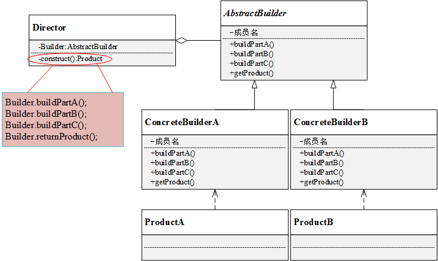

# 建造者模式

建造者模式将客户端与包含多个部件的复杂对象的创建过程分离，客户端不必知道复杂对象的内部组成方式和装配方式。只需知道所需建造者的类型即可。

### 建造者模式定义

将一个复杂对象的构建与它的表示分离，使得同样的构建过程可以创建不同的表示。

## 建造者模式结构

- 抽象建造者 AbstractBuilder：创建一个 Product 对象的各个部件的抽象接口；
- 具体建造者 ConcreteBuilder：实现 AbstractBuilder 的接口，实现各个部件的具体构造方法和装配方法，并返回创建结果；
- 产品 Product：具体的产品对象；
- 指挥者 Director：构造一个使用 Builder 接口的对象，安排复杂对象的构建过程，客户端一般都只需要与 Director 交互，指定构造者类型，然后通过构造函数或 setter 方法将具体建造者对象传入 Director。

### 总结

客户端只需指定具体建造者，并作为参数传递给指挥者，通过指挥者即可得到结果。

优点：

- 建造者模式中，客户端不需要知道产品内部组成细节，将产品本身和产品的创建过程分离，使同样的创建过程可以创建不同的产品对象。
- 不同建造者相互独立，方便替换。

缺点：

- 建造者模式所创建的产品一般具有较多的共同的，其组成部分相似，产品之间差异很大，则不适合使用建造者模式。
- 如果产品的内部变化复杂，可能会导致需要定义很多具体建造者类来实现变化，导致系统变得很大。

适用环境：

- 需要生成的产品对象有复杂的内部结构（多个成员变量）；
- 产品对象内部属性有一定的生成顺序；
- 同一个创建流程适用于多种不同的产品。