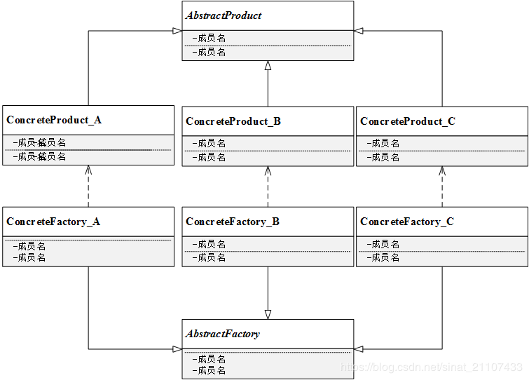

# 工厂方法模式

简单工厂模式最大问题在于违背了开闭原则，为了规避这种不足，来学习工厂方法模式。

简单工厂模式中，每新增一个具体产品，就需要修改工厂类内部的判断逻辑。为了不修改工厂类，遵循开闭原则，**工厂方法模式中不再使用工厂类统一创建所有的具体产品，而是针对不同的产品设计了不同的工厂，每个工厂只生产特定的产品**。

### 工厂方法模式定义

定义一个用于创建对象的接口，但是让子类决定将哪一个类实例化。工厂方法让一个类的实例化推迟到其子类。

## 工厂方法模式结构

- 抽象工厂 AbstractFactory：所有生成具体产品的工厂类的基类，提供工厂类的公共方法；
- 具体工厂 ConcreteFactory：生成具体的产品；
- 抽象产品 AbstractProduct：所有产品的基类，提供产品类的公共方法；
- 具体产品 ConcreteProduct：具体的产品类。

### 总结

在工厂方法模式下，新增具体产品只需要增加一个工厂，然后再客户端修改具体工厂类的类名，原有的类代码无需修改。相较简单工厂模式，工厂方法模式更符合开闭原则。

优点：

- 工厂方法用于创建客户所需产品，同时向客户隐藏某个具体产品类将被实例化的细节，用户只需关心所需产品对应的工厂；
- 工厂自主决定创建何种产品，并且创建过程封装在具体工厂对象内部，多态性设计是工厂方法模式的关键；
- 新加入产品时，无需修改原有代码，增加了系统的可扩展性，符合开闭原则。

缺点：

- 添加产品需要添加新的工厂，类数量成对增加，增加复杂度；
- 工厂和产品都引入了抽象层，客户端代码都是用抽象层。

适用环境：

- 客户端不需要知道它所需要的对象的类；
- 抽象工厂类通过其子类来指定创建哪个对象（运用多态性设计和里氏代换原则）。