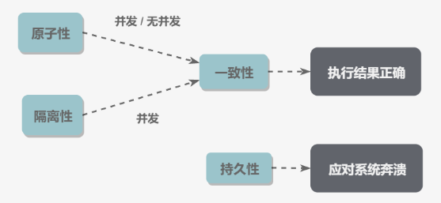

# 数据库系统原理

## 事务

### Transaction

事务是指满足 ACID 特征的一组操作，可以通过 Commit 提交一个事务，也可以 Rollback 进行回滚。

### ACID

#### 1. 原子性 Atomicity

事务被视为不可分割的最小单元，事务的所有操作要么全部提交成功，要么全部失败回滚。

回滚可以通过回滚日志 (Undo Log) 实现，日志记录事务所执行的修改操作，回滚时反向执行这些修改即可。

#### 2. 一致性 Consistency

数据库在事务执行前后都保持一致性状态，所有事务对同一数据的读取结果是相同的。

#### 3. 隔离性 Isolation

一个事务所做的修改在最终提交前对其他事务不可见。

#### 4. 持久性 Durability

一旦事务提交，则其所做的修改将会永远保存到数据库中。

系统发生崩溃可以用重做日志 (Redo Log) 进行恢复，从而实现持久性。与回滚日志记录数据的逻辑修改不同，重做日志记录的是数据页的物理修改。

#### 总结

- 一致性用于保证事务执行结果争取。
- 持久性用于应对系统崩溃。
- 无并发的情况下，只要满足原子性就能满足一致性。
- 并发时，满足原子性和隔离性才能满足一致性。

### AUTOCOMMIT

MySQL 默认采用自动提交模式，如果不显式使用 `START TRANSACTION` 语句来开始一个事务，每个查询操作都会被当做一个事务并自动提交。

## 并发一致性问题

并发环境下，事务的隔离性很难保证，因此会出现并发一致性问题。

### 丢失修改

两个事务都对一个数据进行修改，后面的会覆盖前面的。

### 读脏数据

T1 修改一个数据，T2 随后读取这个数据。如果 T1 撤销了修改，那么 T2 读取的数据是脏数据。

### 不可重复读

T2 读取一个数据，T1 对该数据做了修改。如果 T2 再次读取这个数据，两次读取的结果不同。

### 幻影读

T1 读取某个范围的数据，T2 在这个范围内插入数据，T1 再次读取这个范围的数据时，两次读取的结果不同。

## 封锁

并发不一致性问题的主要原因是破坏了事务的隔离性，解决方法是通过并发控制保证隔离性。可以通过封锁操作实现。

### 封锁粒度

MySQL 提供了两种封锁粒度：行级锁以及表级锁。

应该尽量只锁定需要修改的那部分数据，锁定的数据流越少，发生锁争用的可能就越小，并发度越高。

加锁需要消耗资源，锁的各种操作都会增加系统开销。因此粒度越小，开销越大。

### 封锁类型

#### 1. 读写锁

1. 互斥锁 Exclusive，X 锁，写锁。

2. 共享锁 Shared，S 锁，读锁。

- 一个事务对数据对象 A 加了 X 锁，就可以对 A 进行读取和更新。加锁期间其他事务不能对 A 加任何锁。
- 一个事务对数据对象 A 加了 S 锁，可以对 A 进行读取操作，但不能更新。加锁期间其他事务可以对 A 加 S 锁，不能加 X 锁。

|     | X   | S   |
| --- | --- | --- |
| X   | NO  | NO  |
| S   | NO  |     |

#### 2. 意向锁

意向锁可以更容易支持多粒度封锁。

在存在行级锁和表级锁的情况下，事务 T 想对表 A 加 X 锁，需要检测是否有其他事务对表 A 或其中的任意一行加了锁，每行都检测，非常耗时。

意向锁在原 X/S 锁之上引入了 IX/IS，是表锁，用来表示一个事务想要对表中的某个数据行上加 X/S 锁。

- 一个事务在获得某个数据行对象的 S 锁之前，必须先获得表的 IS 锁或者更强的锁。
- 一个事务在获得某个数据行对象的 X 锁之前，必须先获得表的 IX 锁。

引入意向锁，事务 T 想要对表 A 加 X 锁，只需检测是否有其他事务对 A 加了 X/IX/S/IS 锁，如果有则 T 加锁失败。

兼容关系为：

1. 任意 IS/IX 锁之间兼容。
2. 表级 IX 锁和行级的 X 锁兼容，即两个事务可以对两个数据行加 X 锁。

|     | X   | IX  | S   | IS  |
| --- | --- | --- | --- | --- |
| X   | NO  | NO  | NO  | NO  |
| IX  | NO  |     | NO  |     |
| S   | NO  | NO  |     |     |
| IS  | NO  |     |     |     |

### 封锁协议

#### 1. 三级封锁协议

1. 一级封锁协议

   事务 T 要修改数据 A 必须加 X 锁，直到 T 结束才释放锁。

   可解决丢失修改问题，无法同时修改，修改不会被覆盖。

2. 二级封锁协议

   在一级的基础上，要求读取数据 A 必须加 S 锁，读取完马上释放 S 锁。

   可解决读脏数据问题，修改时无法加 S 锁。

3. 三级封锁协议

   在二级的基础上，要求读取数据 A 时必须加 S 锁，直到事务结束才能释放 S 锁。

   可解决不可重复读问题，读 A 时，其他事务不能对 A 加 X 锁。

#### 2. 两段锁协议

加锁和解锁分两个阶段。

可串行化调度，通过并发控制，使得并发执行的事务结果与某个串行执行的事务结果相同。

事务遵循两段锁协议是保证可串行化调度的充分条件，但不是必要条件。

### MySQL 隐式与显式锁定

MySQL 的 InnoDB 引擎采用两段锁协议，根据隔离级别在需要时自动加锁，并且所有的锁在同一时刻被释放，称为隐式锁定。

## 隔离级别

### 未提交读 Read UNCOMMITED

事务中的修改，即使没有提交，对其他事务也是可见的。

### 提交读 Read COMMITED

一个事务只能读取已经提交的事务所做的修改，即事务所做的修改在提交之前对其他事务不可见。

### 可重复读 Repeatable Read

保证在同一个事务中多次读取同一数据的结果是一样的。

### 可串行化 Serializable

强制事务串行执行，需要加锁实现。

隔离级别可解决的并发一致性问题：

|          | 脏读 | 不可重复读 | 幻影读 |
| -------- | ---- | ---------- | ------ |
| 未提交读 | NO   | NO         | NO     |
| 提交读   | YES  | NO         | NO     |
| 可重复读 | YES  | YES        | NO     |
| 可串行化 | YES  | YES        | YES    |

## 多版本并发控制

Multi-Version Concurrency Control, MVCC 是 InnoDB 引擎实现隔离的一种具体方式，用于实现提交读和可重复读两种隔离级别。可串行化需要对所有读取的行加锁。

### 基本思想

写操作更新最新的版本快照，读操作去读旧版本快照，没有互斥关系。

MVCC 中的事务修改操作会为数据行新增一个版本快照。

脏读和不可重复读的根本原因是事务读取到其他事务未提交的修改，MVCC 规定只能读取已提交的快照。

### 版本号

- 系统版本号 SYS_ID：每开始一个新的事务，系统版本号就会自动递增。
- 事务版本号 TRX_ID：事务开始时的系统版本号。

### Undo 日志

MVVC 多版本即多个版本的快照，快照存储在 Undo 日志中，该日志通过回滚指针 ROLL_PTR 把一个数据行的所有快照连接起来。

### ReadView

MVCC 提供了一个 ReadView 结构，主要包含了当前系统未提交的事务列表，以及列表中事务版本号的最小值最大值。

在进行 SELECT 操作时，可以根据数据行快照的 TRX_ID 与 TRX_ID_MIN 和 TRX_ID_MAX 之间的关系判断数据行快照能否使用：

- TRX_ID < TRX_ID_MIN，表示该数据行快照是在当前所有未提交事务之前更改的，可以使用。
- TRX_ID > TRX_ID_MAX，表示该数据行快照是在事务启动之后被更改的，因此不可使用。
- 根据隔离等级判断：
  - 提交读：TRX_ID 在列表中，表示对应事务尚未提交，则快照不可使用。
  - 可重复读：都不可以使用。

数据行快照不可用时，需要沿着 Undo 日志的回滚指针找到下一个可用快照。

### 快照读与当前读

#### 1. 快照读

MVCC 的 SELECT 操作是快照中的数据，不需要进行加锁。

#### 2. 当前读

MVCC 其他会对数据库进行修改的操作都需要进行加锁，从而读取最新的数据。

## Next-Key Locks

Next-Key Locks 是 MySQL 的 InnoDB 引擎的一种锁实现。

MVCC 不能解决幻影读问题，在可重复读隔离级别下，使用 MVCC + Next-Key Locks 可以解决幻影读问题。

### Record Locks

锁定一个记录上的索引，而不是记录本身。

### Gap Locks

锁定所有之间的间隙，但不包括索引本身。

### Next-Key Locks

前两者的结合，不仅锁定一个记录上的索引，也锁定索引之间的间隙。锁定一个左开右闭区间。

## 关系数据库设计理论

### 函数依赖

记 `A->B` 表示 A 函数决定 B，或 B 依赖于 A。

如果 `{A1, A2, ..., An}` 是关系的一个或多个属性的集合，该集合函数决定了关系的其他所有属性并且是最小的（完全依赖），则称该集合为键码。

对于 `A->B`，如果能找到 A 的真子集 A'，使得 `A'->B`，那么 `A->B` 就是部分函数依赖，否则就是完全函数依赖。

对于 `A->B, B->C`，则 `A->C` 是一个传递函数依赖。

### 异常

以下的学生课程关系的函数依赖为 `{Sno, Cname} -> {Sname, Sdept, Mname, Grade}`，键码为 `{Sno, Cname}`。也就是确定了学生和课程之后，就确定其他信息。

| Sno | Sname | Sdept | Mname | Cname | Grade |
| --- | ----- | ----- | ----- | ----- | ----- |
| 1   | s1    | d1    | m1    | c1    | 90    |
| 2   | s2    | d2    | m2    | c2    | 80    |
| 2   | s2    | d2    | m2    | c1    | 100   |
| 3   | s3    | d2    | m2    | c2    | 95    |

不符合范式的关系，会产生很多异常，主要有以下四种异常：

- 冗余数据：如 s2 出现了两次。
- 修改异常：修改一个记录中的信息，但是另一个记录中相同的信息未被修改。
- 删除异常：删除一个信息，那么也会丢失其他信息。如删除 c1 要删除第 1、3 行，s1 的数据会丢失。
- 插入异常：例如想要插入一个学生的信息，如果这个学生还没选课，那么就无法插入。

### 范式

范式理论是为了解决以上的异常，高级别的范式依赖于低级别的范式。

#### 第一范式 1NF

属性不可分。

#### 第二范式 2NF

每个非主属性完全函数依赖于键码。可以通过分解来满足。

上面的例子，以 `{Sno, Cname}` 为键码，有如下函数依赖：

- `Sno -> Sname, Sdept`
- `Sdept -> Mname`
- `Sno, Cname -> Grade`

就需要分解以满足 2NF：

| Sno | Sname | Sdept | Mname |
| --- | ----- | ----- | ----- |
| 1   | s1    | d1    | m1    |
| 2   | s2    | d2    | m2    |
| 3   | s3    | d2    | m2    |

| Sno | Cname | Grade |
| --- | ----- | ----- |
| 1   | c1    | 90    |
| 2   | c2    | 80    |
| 2   | c1    | 100   |
| 3   | c2    | 95    |

#### 第三范式 3NF

非主属性不传递函数依赖于键码。

以上的关系 1 存在传递依赖：`Sno -> Sdept -> Mname`。

进一步分解：

| Sno | Sname | Sdept |
| --- | ----- | ----- |
| 1   | s1    | d1    |
| 2   | s2    | d2    |
| 3   | s3    | d2    |

| Sdept | Mname |
| ----- | ----- |
| d1    | m1    |
| d2    | m2    |

#### BCNF

任何非主属性不能对主键子集依赖。非主属性必须是由所有主属性决定。

消除主属性对码的部分和传递函数依赖。

#### 第四范式 4NF

属性之间不能有非平凡且非函数依赖的多值依赖。