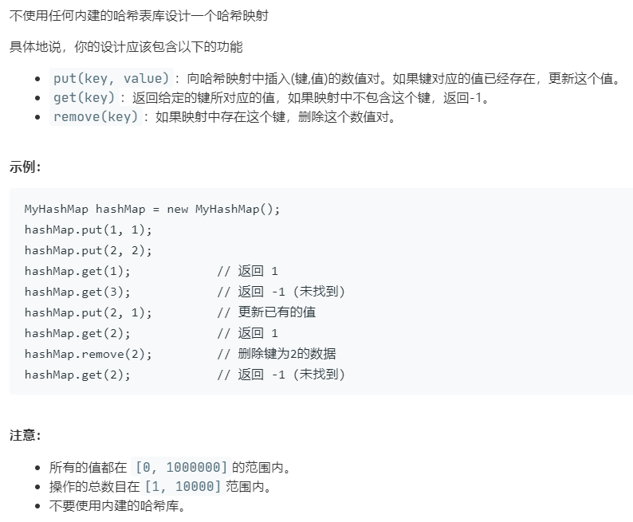

# 706.设计哈希映射 (Easy)

## 题目描述



### 标签

哈希表；

## 思路 & 代码

肯定得用数组实现随机存储，最简单的肯定就是取余。冲突的话可以使用数组或链表存，如果对检索要求高的可以使用二叉搜索树。

还可以使用位运算，充分利用每一位。

```c++ tab="位运算"
class MyHashSet {
public:
    /** Initialize your data structure here. */
    vector<uint32_t> items;
    MyHashSet() : items(31251, 0) { }
    
    void add(int key) {
        items[key >> 5] |= 1 << (key & 0b11111);
    }
    
    void remove(int key) {
        items[key >> 5] &= ~(1 << (key & 0b11111));
    }
    
    /** Returns true if this set contains the specified element */
    bool contains(int key) {
        return items[key >> 5] & 1 << (key & 0b11111);
    }
};
```