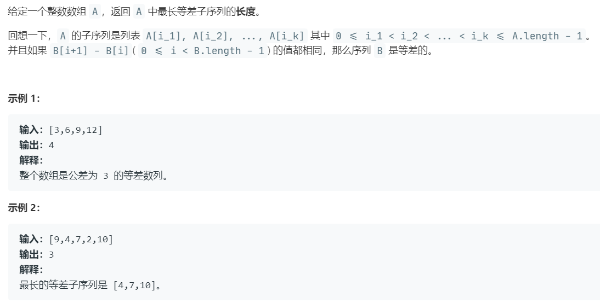

# 1027.最长等差数列 (Medium)

## 题目描述 



### 标签

动态规划

## 思路 & 代码

dp 又来了。。。

如果 dp[i] 表示 i 结尾的最长等差数列长度，状态转移要怎么写？所以应该是要用二维 dp[i][j] 表示 i 结尾的公差为 j 的最长等差序列长度。给定了元素的范围 [0, 10000]，所以我们就把差值加上偏移 10000 作为第二维。这里优化空间的话可以用哈希表代替内层数组。

还有一种思路是，对于一个等差数列，确定了前两项就确定了后续的值，所以我们每次选两个元素作为数列开头值，求后面的值在数组中的位置。

```c++ tab="dp"
class Solution {
public:
    int longestArithSeqLength(vector<int>& nums) {
        int n = nums.size();
        if(n < 3) {
            return n;
        }
        vector<vector<int>> dp(n, vector<int>(20001, 0));
        int res = 0;
        for(int i = 1; i < n; i++) {
            for(int j = 0; j < i; j++) {
                int dist = nums[i] - nums[j] + 10000;
                if(dp[j][dist] > 0) {
                    dp[i][dist] = max(dp[i][dist], dp[j][dist] + 1);
                }else {
                    dp[i][dist] = 2;
                }
                res = max(res, dp[i][dist]);
            }
        }
        return res;
    }
};
```

```c++ tab="找到等差数列下一项"
class Solution {
public:
    int longestArithSeqLength(vector<int>& nums) {
        int n = nums.size();
        unordered_map<int, vector<int>> hash;
        for(int i = 0; i < n; i++) {
            hash[nums[i]].push_back(i);
        }
        int res = 0;
        int cnt = 2;
        for(int i = 0; i < n - res; i++) {
            for(int j = i + 1; j < n - res + 1; j++) {
                int diff = nums[j] - nums[i];
                if(diff == 0) {
                    if(hash[nums[i]].size() > res) {
                        res = hash[nums[i]].size();
                    }
                    continue;
                }
                int next = diff + nums[j];
                int preIndex = j;
                bool found = false;
                while(hash.count(next)) {
                    auto& tmp = hash[next];
                    for(auto& idx : tmp) {
                        if(idx > preIndex) {
                            preIndex = idx;
                            cnt++;
                            next += diff;
                            found = true;
                            break;
                        }
                    }
                    if(!found) {
                        break;
                    }
                    found = false;
                }
                res = max(res, cnt);
                cnt = 2;
            }
        }
        return res;
    }
};
```