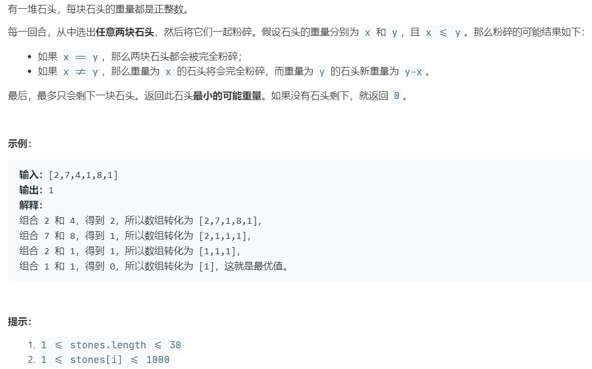

# 1049.最后一块石头的重量 II (Medium)

## 题目描述



### 标签 

动态规划

## 思路 & 代码

每次选出两个石头，要求最后的可能重量。其实就是把所有石头分成两组，要求总和之差最小。

转换成 01 背包问题，dp[i] 表示容量为 i 的背包最多可以装的石头总重量，状态转移方程为 dp[j] = max(dp[j], dp[j - stones[i]] + stones[i])。

```c++ tab="dp"
class Solution {
public:
    int lastStoneWeightII(vector<int>& stones) {
        int sum = accumulate(stones.begin(), stones.end(), 0);
        int target = sum / 2;
        int n = stones.size();
        vector<int> dp(target + 1, 0);
        for(int i = 0; i < n; i++) {
            for(int j = target; j >= stones[i]; j--) {
                // 注意这里 dp[j] 的值表示的是 容量为 j 的背包最多装石头的重量
                dp[j] = max(dp[j], dp[j - stones[i]] + stones[i]);
            }
        }
        return sum - 2 * dp[target];
    }
};
```