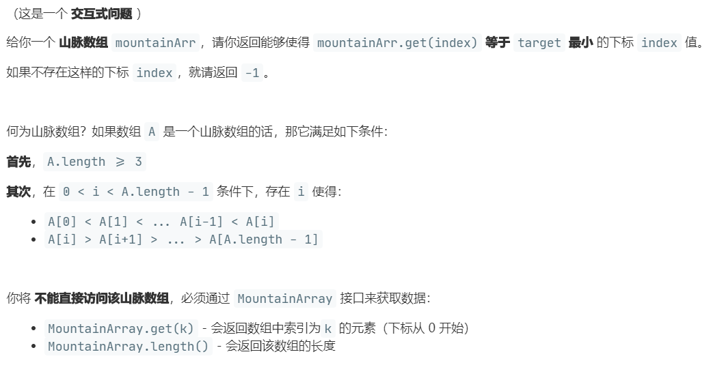
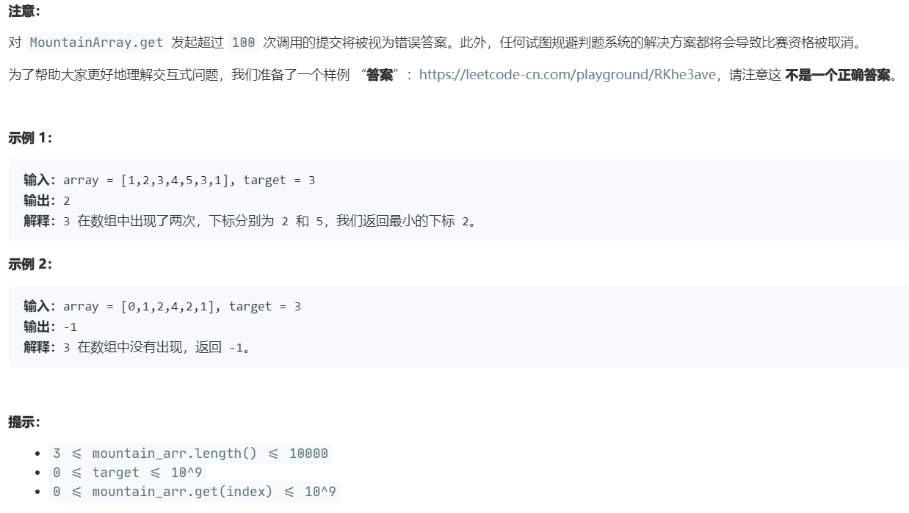

# 1095.山脉数组中查找目标值 (Hard)

## 题目描述





### 标签

二分查找；

## 思路 & 代码

山脉数组就是先递增再递减，题目要求访问数组元素的次数不超过 100，那应该就得用二分了。之前做过找 [数组中任意一个峰值](162.md) 的题，二分查找时通过 mid 和 mid + 1 的大小关系判断此处是处于升序还是降序。这样找到峰值后就分别在左右二分找到 target 的最左边界就行了。

```c++
/**
 * // This is the MountainArray's API interface.
 * // You should not implement it, or speculate about its implementation
 * class MountainArray {
 *   public:
 *     int get(int index);
 *     int length();
 * };
 */

class Solution {
public:
    int findInMountainArray(int target, MountainArray &mountainArr) {
        int n = mountainArr.length();
        int l = 0, r = n - 1;
        int peek = 0;
        while(l < r) {
            int mid = l + (r - l) / 2;
            if(mountainArr.get(mid) < mountainArr.get(mid + 1)) {
                l = mid + 1;
                peek = mid + 1;
            }else {
                r = mid;
            }
        }
        if(mountainArr.get(peek) == target) {
            return peek;
        }else if(mountainArr.get(peek) < target) {
            return -1;
        }
        l = 0, r = peek + 1;
        while(l < r) {
            int mid = l + (r - l) / 2;
            if(mountainArr.get(mid) < target) {
                l = mid + 1;
            }else {
                r = mid;
            }
        }
        if(l != peek + 1 && mountainArr.get(l) == target) {
            return l;
        }
        l = peek + 1, r = n;
        while(l < r) {
            int mid = l + (r - l) / 2;
            if(mountainArr.get(mid) > target) {
                l = mid + 1;
            }else {
                r = mid;
            }
        }
        if(l != n && mountainArr.get(l) == target) {
            return l;
        }
        return -1;
    }
};
```