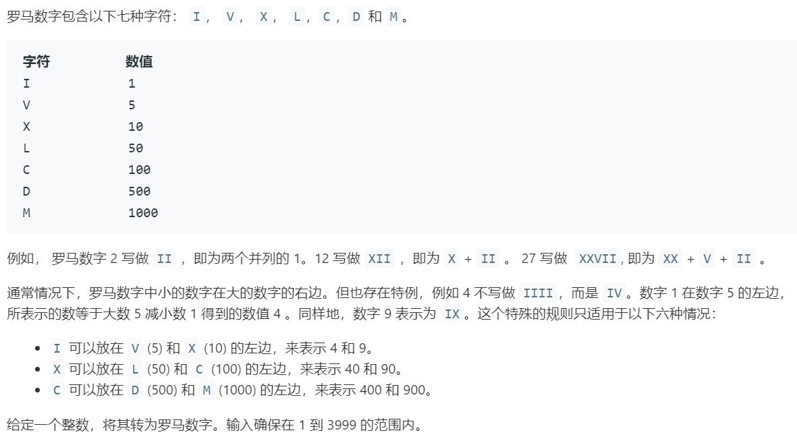

# 12.整数转罗马数字 (Medium)

## 题目描述



### 标签

贪心；

## 思路 & 代码

主要看这么麻烦的就是 4, 9, 40, 90 这种数。如果一点点判断感觉很麻烦，但是把这些情况都记录一下就行了。

```c++ tab="贪心"
class Solution {
public:
    string intToRoman(int num) {
        vector<pair<int, string>> strMap = {
            {1000, "M"}, {900, "CM"}, {500, "D"}, {400, "CD"}, {100, "C"}, {90, "XC"},
            {50, "L"}, {40, "XL"}, {10, "X"}, {9, "IX"}, {5, "V"}, {4, "IV"}, {1, "I"}
        };
        int len = strMap.size();
        string res = "";
        for(int i = 0; i < len; i++) {
            while(num >= strMap[i].first) {
                num -= strMap[i].first;
                res += strMap[i].second;
            }
        }
        return res;
    }
};
```

```c++ tab="直接列举"
class Solution {
public:
    string intToRoman(int num) {
        // 0, 1000, 2000, 3000
        vector<string> M = {"", "M", "MM", "MMM"}; 
        // 0, 100, 200, ..., 900
        vector<string> C = {"", "C", "CC", "CCC", "CD", "D", "DC", "DCC", "DCCC", "CM"};
        // 0, 10, 20, ..., 90
        vector<string> X = {"", "X", "XX", "XXX", "XL", "L", "LX", "LXX", "LXXX", "XC"};
        // 0, 1, 2, ..., 9
        vector<string> I = {"", "I", "II", "III", "IV", "V", "VI", "VII", "VIII", "IX"};
        return M[num / 1000] + C[(num % 1000) / 100]+ X[(num % 100) / 10] + I[num % 10];
    }
};
```