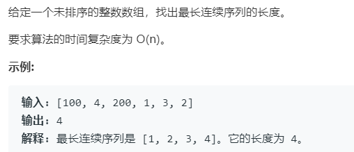

# 128.最长连续序列 (Hard)

## 题目描述



### 标签

并查集；

## 思路 & 代码

这个题得看清楚是啥意思。。。看示例之前我以为是找最长递增子数组。。。他这最长连续序列就是连续的整数。

最简单的就是先排序，这样就方便找连续序列。但是排序的时间复杂度最低就是 $O(n\log n)$，要求 $O(n)$。需要通过哈希表快速判断元素是否在数组中。

```c++ tab="哈希表"
class Solution {
public:
    int longestConsecutive(vector<int>& nums) {
        unordered_set<int> hash(nums.begin(), nums.end());
        int res = 0;
        for(auto num : nums) {
            if(hash.count(num - 1)) {
                continue;
            }
            int len = 1;
            while(hash.count(num + 1)) {
                num++, len++;
            }
            res = max(res, len);
        }
        return res;
    }
};
```