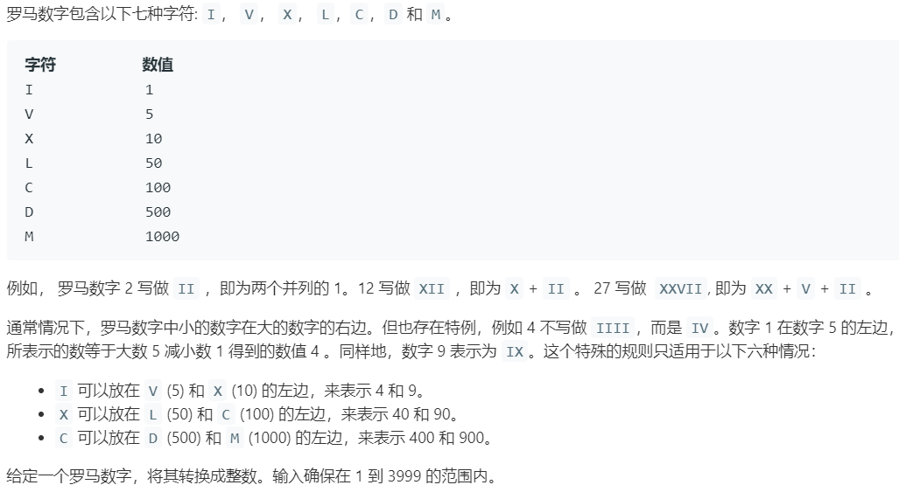

# 13.罗马数字转整数 (Easy)

## 题目描述



## 思路 & 代码

整数转罗马数字的写过了之后这个就简单很多了。

```c++
class Solution {
public:
    int romanToInt(string s) {
        unordered_map<string, int> m = {
            {"I", 1}, {"IV", 3}, {"IX", 8}, {"V", 5}, {"X", 10}, {"XL", 30}, {"XC", 80}, {"L", 50}, {"C", 100}, {"CD", 300}, {"CM", 800}, {"D", 500}, {"M", 1000}};
        int r = m[s.substr(0, 1)];
        for(int i=1; i<s.size(); ++i){
            string two = s.substr(i-1, 2);
            string one = s.substr(i, 1);
            r += m[two] ? m[two] : m[one];
        }
        return r;
    }
};
```