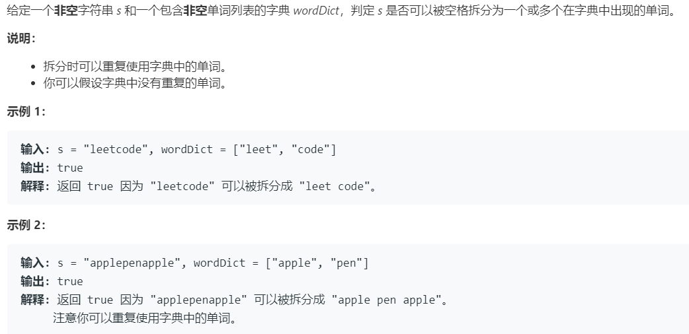

# 139.单词拆分 (Medium)

## 题目描述



### 标签

动态规划；

## 题目描述

最丧心病狂的做法就是用词典里的单词拼接生成字符串，判断目标串是否在里面。

“一瞅就是动态规划”系列，dp[i] 表示子串 [0, i) 是否能由词典构成，dp[i] = dp[j] && dict.count(substr(j, i - j));

dp 可以通过剪枝优化，剪枝的操作类似于 [55.跳跃游戏](./55.md)，第 i 个字符是某个词的首字母，设置一个遍历记录最右的首字母位置，如果 i 超过了这个值就可以返回 false。

```c++ tab="dp"
class Solution {
public:
    bool wordBreak(string s, vector<string>& wordDict) {
        int size = wordDict.size();
        int len = s.length();
        if(size == 0) {
            return false;
        }
        unordered_set<string> dict(wordDict.begin(), wordDict.end());
        vector<bool> dp(len + 1, false);
        dp[0] = true;
        for(int i = 1; i <= len; i++) {
            for(int j = 0; j < i; j++) {
                dp[i] = dp[j] && (dict.count(s.substr(j, i - j)) != 0);
                if(dp[i]) {
                    break;
                }
            }
        }
        return dp[len];
    }
};
```

```c++ tab="dp 剪枝"
class Solution {
public:
    bool wordBreak(string s, vector<string>& wordDict) {
        int len = s.length();
        if(len == 0) {
            return false;
        }
        int r = 0;
        vector<bool> dp(len + 1, false);
        dp[0] = true;
        for(int i = 0; i < len; i++) {
            if(i > r) {
                return false;
            }
            if(!dp[i]) {
                continue;
            }
            for(auto& word : wordDict) {
                int curLen = word.length();
                int cur = i + curLen;
                if(cur > len) {
                    continue;
                }
                if(s.substr(i, curLen) == word) {
                    dp[cur] = true;
                    r = max(r, cur);
                }
            }
        }
        return dp[len];
    }
};
```