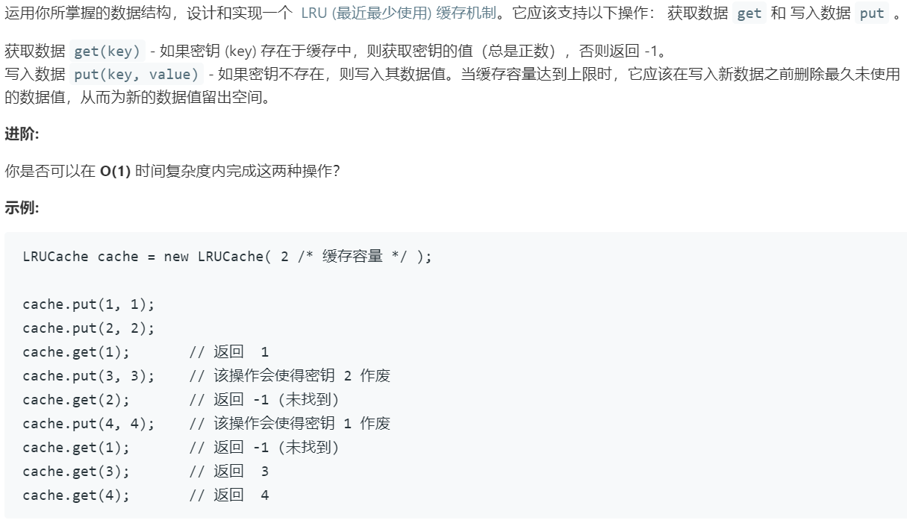

# 146.LRU 缓存机制 (Mediium)

## 题目描述



### 标签

设计；哈希表

## 思路 & 代码

LRU Least Recently Used，常见的页面替换算法，页满时淘汰最近最久使用的的页面。

$O(1)$ 的话就得用哈希表存键值对，可以用链表维护页面的顺序，第一次访问的时候插入链表尾部，访问时在链表中找到元素后移动到表尾，页满时就删除链表头的元素。为了方便移动可以使用双向链表，这里为了熟悉一下双向链表就不用 list 了，自己实现一个。要注意的是，如果 put 的 key 已经在哈希表中，只修改值且执行 get 操作即可。

```c++ tab="双向链表+哈希表"
struct myListNode {
    int key;
    int val;
    myListNode *prev;
    myListNode *next;
    myListNode(int _key, int _val) : key(_key), val(_val), prev(nullptr), next(nullptr) {}
};

class LRUCache {
private:
    myListNode *head;
    myListNode *tail;
    unordered_map<int, myListNode*> cache;
    size_t capacity;
public:
    LRUCache(int _capacity) {
        head = new myListNode(-1, -1);
        tail = head;
        capacity = _capacity;
    }
    
    int get(int key) {
        if(cache.count(key)) {
            auto cur = cache[key];
            if(cur != tail) {
                cur->prev->next = cur->next;
                cur->next->prev = cur->prev;
                tail->next = cur;
                cur->prev = tail;
                cur->next = nullptr;
                tail = cur;
            }
            return cur->val;
        }
        return -1;
    }
    
    void put(int key, int value) {
        if(cache.count(key)) {
            cache[key]->val = value;
            get(key);
        }else {
            if(cache.size() == capacity) {
                auto del = head->next;
                cache.erase(del->key);
                head->next = del->next;
                if(del->next != nullptr) {
                    del->next->prev = head;
                }else {
                    tail = del->prev;
                }
                delete del;
                del = nullptr;
            }
            auto cur = new myListNode(key, value);
            tail->next = cur;
            cur->prev = tail;
            tail = cur;
            cache[key] = cur;
        }
    }
};
```