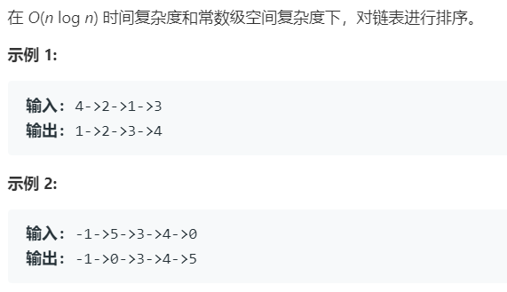

# 148.排序链表 (Medium)

## 题目描述



### 标签

排序；

## 思路 & 代码

链表排序要求复杂度 $O(n\log n)$，就用归并排序。主要的操作就是划分，可以用快慢指针定位中间节点，还有合并，有序链表的合并就直接扫描就行。

```c++ tab="归并排序"
class Solution {
public:
    ListNode* sortList(ListNode* head) {
        ListNode dummyHead(0);
        dummyHead.next = head;
        auto p = head;
        int length = 0;
        while (p) {
            ++length;
            p = p->next;
        }
        
        for (int size = 1; size < length; size <<= 1) {
            auto cur = dummyHead.next;
            auto tail = &dummyHead;
            
            while (cur) {
                auto left = cur;
                auto right = cut(left, size); // left->@->@ right->@->@->@...
                cur = cut(right, size); // left->@->@ right->@->@  cur->@->...
                
                tail->next = merge(left, right);
                while (tail->next) {
                    tail = tail->next;
                }
            }
        }
        return dummyHead.next;
    }
    
    ListNode* cut(ListNode* head, int n) {
        auto p = head;
        while (--n && p) {
            p = p->next;
        }
        
        if (!p) return nullptr;
        
        auto next = p->next;
        p->next = nullptr;
        return next;
    }
    
    ListNode* merge(ListNode* l1, ListNode* l2) {
        ListNode dummyHead(0);
        auto p = &dummyHead;
        while (l1 && l2) {
            if (l1->val < l2->val) {
                p->next = l1;
                p = l1;
                l1 = l1->next;       
            } else {
                p->next = l2;
                p = l2;
                l2 = l2->next;
            }
        }
        p->next = l1 ? l1 : l2;
        return dummyHead.next;
    }
};
```