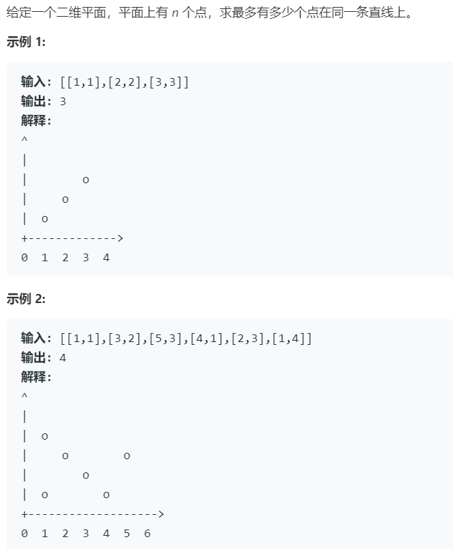

# 149.直线上最多的点 (Hard)

## 题目描述



### 标签

哈希表；数学；

## 思路 & 代码

暴力方法就是对每条直线判断有几个点在上面，优化可以把方程存起来，不用重复统计。主要的问题感觉就是斜率的比较，因为肯定会有小数，想用分数表示就得实现约分化简，如果用乘法代替除法判等还得考虑溢出。

或者可以从点出发，求过这个点的直线上点最多的。感觉严谨的做法还是得用分数比较斜率，后面还写了一个追求速度的版本，先按照差值排序，这样判断重复点比较方便。


```c++ tab="暴力 分数比较斜率"
class Solution {
private:
    int gcd(int a, int b) {
        // return b == 0 ? a : gcd(b, a % b);
        if(a < b) {
            a ^= b;
            b ^= a;
            a ^= b;
        }
        while(b) {
            int tmp = a % b;
            a = b;
            b = tmp;
        }
        return a;
    }
    bool test(int x1, int y1, int x2, int y2, int x, int y) {
        if(x == x2 && y == y2 || x == x1 && y == y1) {
            return true;
        }
        int g1 = gcd(y2 - y1, x2 - x1);
        int g2 = gcd(y - y2, x - x2);
        // 负数的话还可能是正负号反过来
        return (y2 - y1) / g1 == (y - y2) / g2 && (x2 - x1) / g1 == (x - x2) / g2 ||
            (y2 - y1) / g1 == -1 * (y - y2) / g2 && (x2 - x1) / g1 == -1 *(x - x2) / g2;        
    }
public:
    int maxPoints(vector<vector<int>>& points) {
        int len = points.size();
        if(len < 3) {
            return len;
        }
        int i = 0;
        while(i < len - 1 && points[i][0] == points[i + 1][0] && points[i][1] == points[i + 1][1]) {
            i++;
        }
        if(i == len - 1) {
            return len;
        }
        int res = 0;
        for(int i = 0; i < len; i++) {
            for(int j = i + 1; j < len; j++) {
                if(points[i][0] == points[j][0] && points[i][1] == points[j][1]) {
                    continue;
                }
                int cur = 0;
                for(int k = 0; k < len; k++) {
                    if(k != i && k != j) {
                        if(test(points[i][0], points[i][1], points[j][0], points[j][1], points[k][0], points[k][1])) {
                            cur++;
                        }
                    }
                }
                if(cur > res) {
                    res = cur;
                }
            }
        }
        return res + 2;
    }
};
```

```c++ tab="按点分类"
class Solution {
public:
    int maxPoints(vector<vector<int>>& points) {
        int len = points.size();
        if(len < 3) {
            return len;
        }
        int res = 0;
        for(int i = 0; i < len; i++) {
            int same = 0;
            int curMax = 0;
            unordered_map<string, int> lines;
            for(int j = i + 1; j < len; j++) {
                int x = points[j][0] - points[i][0];
                int y = points[j][1] - points[i][1];
                if(x == 0 && y == 0) {
                    same++;
                    continue;
                }
                int g = gcd(x, y);
                x /= g, y /= g;
                string prefix = "+";
                if(x < 0 && y > 0 || x > 0 && y < 0) {
                    prefix = "-";
                }
                x = abs(x);
                y = abs(y);                    
                string key = prefix + to_string(x) + "/" + to_string(y);
                lines[key]++;
                curMax = max(lines[key], curMax);
            }
            res = max(curMax + same + 1, res);
        }
        return res;
    }
};
```

```c++ tab="优化 时间"
class Solution {
public:
    int maxPoints(vector<vector<int>>& points) {
        int len = points.size();
        if(len < 3) {
            return len;
        }
        // 按照坐标差值排序
        sort(points.begin(), points.end(), [&](const vector<int>& a, const vector<int>& b) -> int {
            return abs(a[0] - a[1]) < abs(b[0] - b[1]);
        });
        int res = 0;
        for(int i = 1; i < len; i++) {
            int x = points[i][0];
            int y = points[i][1];
            int dx = x - points[i - 1][0];
            int dy = y - points[i - 1][1];
            int cnt = 0;
            if(dx == 0 && dy == 0) {
                for(int j = 0; j < len; j++) {
                    cnt += (points[j][0] == x && points[j][1] == y);
                }
            }else {
                for(int j = 0; j < len; j++) {
                    cnt += ((points[j][1] - y) * static_cast<long>(dx) == static_cast<long>(dy) * (points[j][0] - x));
                }
            }
            res = max(res, cnt);
        }
        return res;
    }
};
```