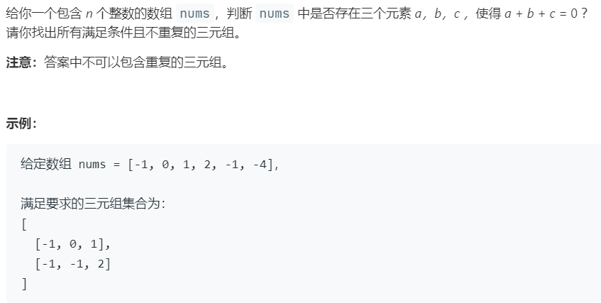

# 15.三数之和 (Medium)

## 题目描述



### 标签

双指针；

## 思路 & 代码

找和为 0 的三个元素，先排序，然后对每个元素，双指针检索其后是否有满足条件的值。

```c++ tab="双指针"
class Solution {
public:
    void quickSort(vector<int>& nums, int l, int r) {
        if(l >= r) {
            return;
        }
        swap(nums[l], nums[l + rand() % (r - l + 1)]);
        int finalPos = l + 1;
        for(int i = l + 1; i <= r; i++) {
            if(nums[i] < nums[l]) {
                swap(nums[i], nums[finalPos++]);
            }
        }
        swap(nums[l], nums[--finalPos]);
        quickSort(nums, l, finalPos - 1);
        quickSort(nums, finalPos + 1, r);
    }
    
    // 排序后双指针
    vector<vector<int>> threeSum(vector<int>& nums) {
        int n = nums.size();
        vector<vector<int>> res;
        if(n < 3) {
            return res;
        }
        quickSort(nums, 0, n - 1);
        // sort(nums.begin(), nums.end());
        for(int i = 0; i < n; i++) {
            if(nums[i] > 0) {
                break;
            }
            if(i > 0 && nums[i] == nums[i - 1]) {
                continue;
            }
            int l = i + 1, r = n - 1;
            while(l < r) {
                int sum = nums[i] + nums[l] + nums[r];
                if(sum == 0) {
                    res.push_back({nums[i], nums[l], nums[r]});
                    while(l < r && nums[l] == nums[l + 1]) {
                        l++;
                    }
                    while(l < r && nums[r] == nums[r - 1]) {
                        r--;
                    }
                    l++, r--;
                }else if(sum > 0) {
                    r--;
                }else {
                    l++;
                }
            }
            
        }
        return res;
    }
};
```