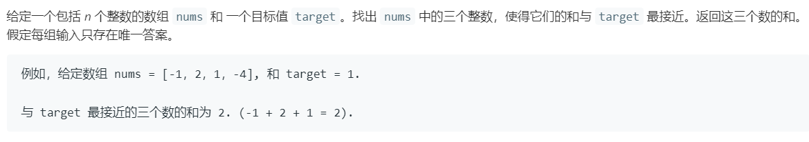

# 16.最接近的三数之和 (Medium)

## 题目描述



### 标签

双指针；

## 思路 & 代码

之前做过三数之和的题，找到和为 0 的三个数，排序之后在当前元素后找到满足条件的两个元素即可。

到这个题，最简单的当然还是暴力，时间复杂度 $O(n^3)$。

再就是根据上一题的思路，排序之后双指针。要注意的是当和为 target 时直接返回就行了。

```c++ tab="暴力"
class Solution {
public:
    int threeSumClosest(vector<int>& nums, int target) {
        int n = nums.size();
        int res = 0;
        int diff = INT_MAX;
        for(int i = 0; i < n; i++) {
            for(int j = i + 1; j < n; j++) {
                for(int k = j + 1; k < n; k++) {
                    int curDiff = abs(nums[i] + nums[j] + nums[k] - target);
                    if(curDiff < diff) {
                        diff = curDiff;
                        res = nums[i] + nums[j] + nums[k];
                    }
                }
            }
        }
        return res;
    }
};
```

```c++ tab="排序后二分"
class Solution {
private:
    void quickSort(vector<int>& nums, int l, int r) {
        if(l > r) {
            return;
        }
        swap(nums[l], nums[l + rand() % (r - l + 1)]);
        int finalPos = l + 1;
        for(int i = l + 1; i <= r; i++) {
            if(nums[i] < nums[l]) {
                swap(nums[i], nums[finalPos++]);
            }
        }
        swap(nums[l], nums[--finalPos]);
        quickSort(nums, l, finalPos - 1);
        quickSort(nums, finalPos + 1, r);
    }
public:
    int threeSumClosest(vector<int>& nums, int target) {
        int n = nums.size();
        // sort(nums.begin(), nums.end());
        quickSort(nums, 0, n - 1);
        int res = 0;
        int diff = INT_MAX;
        for(int i = 0; i < n; i++) {
            int l = i + 1, r = n - 1;
            while(l < r) {
                int curSum = nums[i] + nums[l] + nums[r];
                int curDiff = abs(curSum - target);
                if(curDiff < diff) {
                    res = curSum;
                    diff = curDiff;
                }
                if(curSum > target) {
                    r--;
                }else if(curSum < target){
                    l++;
                }else {
                    return res;
                }
            }
        }
        return res;
    }
};
```