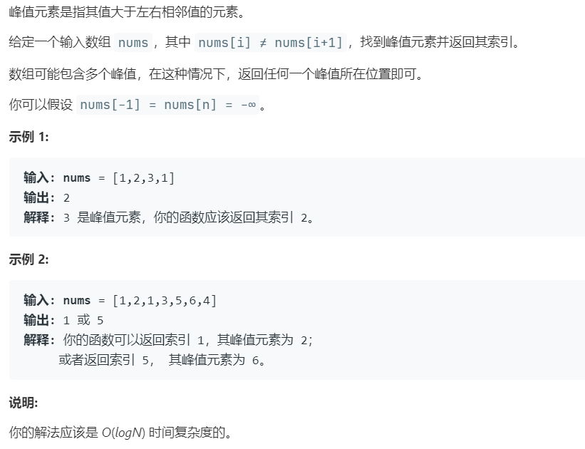

# 162.寻找峰值 (Medium)

## 题目描述



### 标签

二分查找；

## 思路 & 代码

最无脑肯定就线性扫描，要求 $O(\log n)$ 那就得二分。无序的数组可以看成一段段升序和降序数组的拼接，这样就会出现峰值，二分时判断终点时处于升序还是降序，即 nums[mid] 和 nums[mid + 1] 的关系，即 `nums[mid] > nums[mid + 1]` 降序，峰值在左，`nums[mid] < nums[mid + 1]` 升序，峰值在右。


```c++ tab="二分查找"
class Solution {
public:
    int findPeakElement(vector<int>& nums) {
        int n = nums.size();
        int l = 0, r = n - 1;
        while(l < r) {
            int mid = l + (r - l) / 2;
            if(nums[mid] > nums[mid + 1]) {
                r = mid;
            }else {
                l = mid + 1;
            }
        }
        return l;
    }
};
```