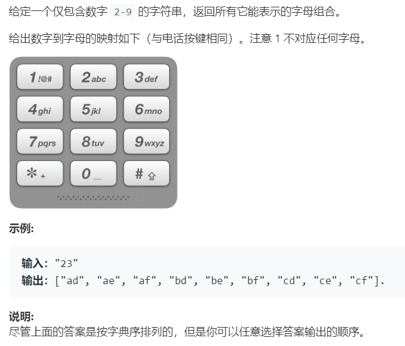

# 17.电话号码的字母组合 (Medium)

## 题目描述



### 标签

回溯算法

## 思路 & 代码

这种排列组合题一瞅就是回溯，然而一写就 8 会。

回溯其实就是决策树的遍历，主要框架如下：

```python tab="回溯框架"
res = []
def backtrack(path, choices) :
    if condition:
        res.add(path)
        return
    for choice in choices:
        do(choice);
        backtrack(path, choices);
        undo(choice);
```

大概就按照这个框架瞎 jb 写就 AC 了。。。还可以用队列实现迭代。

```c++ tab="递归"
class Solution {
private:
    vector<string> strMap = { "abc", "def", "ghi", "jkl", "mno", "pqrs", "tuv", "wxyz" };
    vector<string> res;
    string path;
    string digits;
    int len;
public:
    vector<string> letterCombinations(string _digits) {
        digits = _digits;
        len = digits.length();
        if(len == 0) {
            return res;
        }
        path = "";
        backtrack(0);
        return res;
    }
    void backtrack(int index) {
        if(index == len) {
            res.push_back(path);
            return;
        }
        string cur = strMap[digits[index] - '2'];
        for(auto c : cur) {
            path.push_back(c);
            backtrack(index + 1);
            path.pop_back();
        }
    }
};
```

```c++ tab="迭代"
class Solution {
private:
    vector<string> strMap = { "abc", "def", "ghi", "jkl", "mno", "pqrs", "tuv", "wxyz" };
public:
    vector<string> letterCombinations(string digits) {
        int len = digits.length();
        vector<string> res;
        if(len == 0) {
            return res;
        }
        res.push_back("");
        for(int i = 0; i < len; i++) {
            string cur = strMap[digits[i] - '2'];
            while(res.front().length() == i) {
                string path = res.front();
                res.erase(res.begin());
                for(auto c : cur) {
                    res.push_back(path + c);
                }
            }
        }
        return res;
    }
};
```

