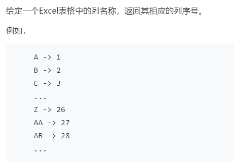

# 171.Excel 表列序号 (Easy)

## 题目描述



## 思路 & 代码

简单的进制转换。

```c++
class Solution {
public:
    int titleToNumber(string s) {
        int res = 0;
        for(auto& c : s) {
            res = res * 26 + (c - 'A' + 1);
        }
        return res;
    }
};

```