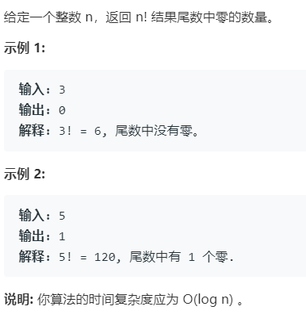

# 172.阶乘后的零 (Easy)

## 题目描述



## 思路 & 代码

阶乘里 2 肯定比 5 多，所以就统计 5 的个数就行了。

```c++
class Solution {
public:
    int trailingZeroes(int n) {
        int res = 0;
        while(n) {
            n /= 5;
            res += n;
        }
        return res;
    }
};
```