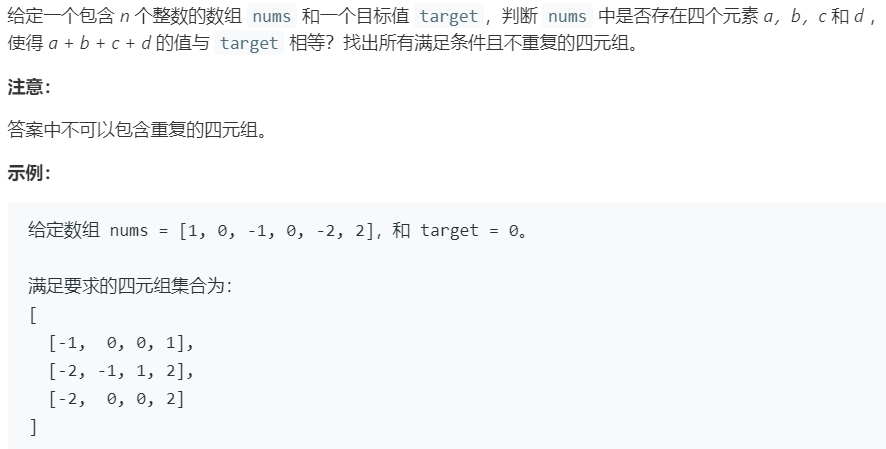

# 18.四数之和 (Medium)

## 题目描述



### 标签

双指针；

## 思路 & 代码

前面有两数、三数、三数最接近，现在又来了个四数，没完没了了。。。

三数的时候是先排序然后在当前数右侧二分查找两个元素。感觉这个也就是在外面套个循环就行，时间复杂度 $O(n^3)$。

```c++ tab="双指针"
class Solution {
public:
    vector<vector<int>> fourSum(vector<int>& nums, int target) {
        int len = nums.size();
        vector<vector<int>> res;
        if(len < 4) {
            return res;
        }
        sort(nums.begin(), nums.end());
        for(int i = 0; i < len; i++) {
            if(nums[i] > target) {
                return res;
            }
            if(i > 0 && nums[i] == nums[i - 1]) {
                continue;
            }
            for(int j = i + 1; j < len - 2; j++) {
                if(j > i + 1 && nums[j] == nums[j - 1]) {
                    continue;
                }
                int l = j + 1, r = len - 1;
                int sum = target - nums[j] - nums[i];
                while(l < r) {
                    int curSum = nums[l] + nums[r];
                    if(curSum == sum) {
                        res.push_back(vector<int>{nums[i], nums[j], nums[l], nums[r]});
                        while(l < r && nums[l] == nums[l + 1]) {
                            l++;
                        }
                        while(l < r && nums[r] == nums[r - 1]) {
                            r--;
                        }
                        l++;
                        r--;
                    }else if(curSum > sum) {
                        r--;
                    }else {
                        l++;
                    }
                }
            }
        }
        return res;
    }
};
```