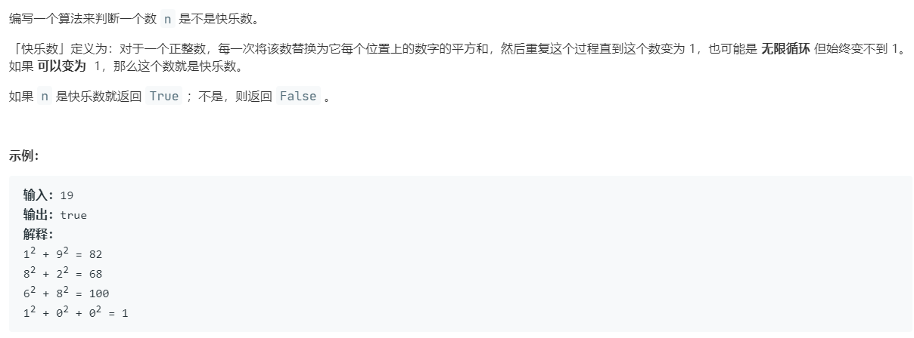

# 202.快乐数 (Easy)

## 题目描述



## 思路 & 代码

这种可能有循环的，就按照判断环形链表的思路，快慢指针就行了。

```c++ tab="快慢指针"
class Solution {
public:
    int squareSum(int n) {
        int res = 0;
        while(n) {
            res += pow(n % 10, 2);
            n /= 10;
        }
        return res;
    }
    bool isHappy(int n) {
        int slow = n, fast = n;
        do {
            slow = squareSum(slow);
            fast = squareSum(squareSum(fast));
        }while(fast != slow);
        return slow == 1;
    }
};
```