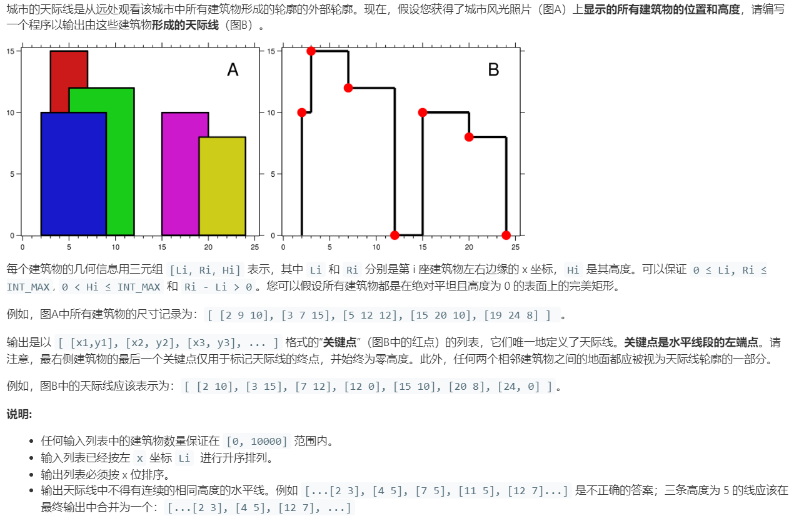

# 218.天际线问题 (Hard)

## 题目描述



### 标签

树状数组；线段树；分治算法；Line Sweep (扫描线)；

## 思路 & 代码

一瞅标签就知道肯定不会了，直奔题解。

扫描线法，使用扫描线，从左到右扫描，遇到左端点，将高度入堆，遇到右端点就删除堆。使用 last 记录上一个转折点。

再就是分治算法，对于一个建筑 [l, r, h]，输出的天际线应该是 {[l, h], [r, 0]}。然后考虑如何合并两组建筑物的天际线，合并方法采用归并排序的双指针。

[线段树](http://www.gavinld.com/2020/02/16/%E7%BA%BF%E6%AE%B5%E6%A0%91/) 现在还不会，有时间学一下。

还看到带哥有一种双向链表的算法。

```c++ tab="扫描线"
class Solution {
public:
    vector<vector<int>> getSkyline(vector<vector<int>>& buildings) {
        vector<vector<int>> res;
        multiset<pair<int, int>> heap;
        for(auto& i : buildings) {
            heap.insert(make_pair(i[0], -1 * i[2]));
            heap.insert(make_pair(i[1], i[2]));
        }
        multiset<int> heights({0});
        vector<int> last = {0, 0};
        for(auto& i : heap) {
            if(i.second < 0) {
                heights.insert(-1 * i.second);          // 左端点，高度入堆
            }else {
                heights.erase(heights.find(i.second));  // 右端点，出堆
            }
            // 当前最大高度
            auto maxHeight = *heights.rbegin();
            // 当前最大高度不同于上一个高度，则是一个转折点
            if(last[1] != maxHeight) {
                last[0] = i.first;
                last[1] = maxHeight;
                res.push_back(last);
            }
        }
        return res;
    }
};
```

```c++ tab="分治算法"
class Solution {
private:
    vector<vector<int>> merge(vector<vector<int>>& buildings, int l, int r) {
        vector<vector<int>> res;
        vector<int> tmp(2);
        if(l == r) {
            tmp[0] = buildings[l][0];
            tmp[1] = buildings[l][2];
            res.push_back(tmp);

            tmp[0] = buildings[l][1];
            tmp[1] = 0;
            res.push_back(tmp);
            return res;
        }
        int mid = l + (r - l) / 2;
        vector<vector<int>> res1 = merge(buildings, l, mid);
        vector<vector<int>> res2 = merge(buildings, mid + 1, r);
        int h1 = 0, h2 = 0, i = 0, j = 0;
        int len1 = res1.size(), len2 = res2.size();
        while(i < len1 || j < len2) {
            long x1 = (i < len1 ? res1[i][0] : LONG_MAX);
            long x2 = (j < len2 ? res2[j][0] : LONG_MAX);
            long x = 0;
            if(x1 < x2) {
                h1 = res1[i++][1];
                x = x1;
            }else if(x1 > x2) {
                h2 = res2[j++][1];
                x = x2;
            }else {
                h1 = res1[i++][1];
                h2 = res2[j++][1];
                x = x1;
            }
            int h = max(h1, h2);
            if(res.empty() || h != res[res.size() - 1][1]) {
                tmp[0] = x;
                tmp[1] = h;
                res.push_back(tmp);
            }
        }
        return res;
    }
public:
    vector<vector<int>> getSkyline(vector<vector<int>>& buildings) {
        int len = buildings.size();
        if(len == 0) {
            return vector<vector<int>>();
        }
        return merge(buildings, 0, len - 1);
    }
};
```

```c++ tab="双向链表"
struct Node {
    int height;
    int left;
    int right;
    Node* next;
    Node* pre;
    bool isPoint()
    {
        return left == right;
    }
    Node(int i, int j): left(i), right(j),height(0) {}
    Node(int i, int j, int h): left(i), right(j),height(h) {}
    Node(int h): left(NULL), right(NULL), height(h) {}
};

// 在left，right间加入cur
void connect(Node* left, Node* right, Node* cur)
{
    left->next = cur;
    cur->next = right;
    right->pre = cur;
    cur->pre = left;
}

// 删除结点cur
void deleteNode(Node*cur)
{
    cur->pre->next = cur->next;
    cur->next->pre = cur->pre;
    delete cur;
}

//向左合并，直到遇到头节点或者高度不同的区间
void leftMerge(Node* cur)
{
    Node* pre = cur->pre;
    while(pre->height != -1 && pre->height == cur->height)
    {
        cur->left = pre->left;
        deleteNode(pre);
        pre = cur->pre;
    }
}

//向右合并，直到遇到尾节点或者高度不同的区间
void rightMerge(Node* cur)
{
    Node* next = cur->next;
    while(next->height != -1 && next->height == cur->height)
    {
        cur->right = next->right;
        deleteNode(next);
        next = cur->next;
    }
    
}


class Solution {
public:
    vector<vector<int>> getSkyline(vector<vector<int>>& buildings) {
        if(buildings.empty())   return {};
        Node* head = new Node(-1);
        Node* tail = new Node(-1);
        Node* tmp = new Node(INT_MIN, INT_MAX);
        connect(head,tail,tmp);


        for(auto& b: buildings)
        {
            int left = b[0];
            int right = b[1];
            int height = b[2];

            Node* cur = head->next;
            while(cur != tail)
            {
                if(left >= cur->right)  
                {
                    cur = cur->next;
                    continue;
                }
                else    //找到头区间
                {
                    if(right <= cur->right) // 若新加入区间正好落在头区间内
                    {
                        if(height > cur->height)
                        {
                            Node* tmp1 = new Node(left,right,height);
                            Node* tmp2 = NULL;
                            if(cur->right != right)
                                tmp2 = new Node(right, cur->right,cur->height);
                            cur->right = left;
                            connect(cur, cur->next, tmp1);
                            if(tmp2)
                                connect(tmp1,tmp1->next,tmp2);
                            if(cur->isPoint())  deleteNode(cur);
                            leftMerge(tmp1);    
                            rightMerge(tmp1);
                            //左右合并相同高度的区间
                        }
                        
                    }
                    else
                    {
                        Node* h = cur;  //头区间
                        Node* t = cur->next;    // 确定尾区间
                        while(t->right < right)
                        {
                            if(height > t->height)
                                t->height = height;
                            t = t->next;
                        }

                        // 单独处理头区间
                        if(h->height < height)
                        {
                            if(h->left == left) // 新建筑物左侧与头区间左侧重合
                            {
                                h->height = height;
                                leftMerge(h);
                            }
                            else
                            {
                                Node* tmp = new Node(left,h->right, height);
                                h->right = left;
                                connect(h,h->next,tmp);
                                h = tmp;
                            }
                        }

                        //单独处理尾区间
                        if(t->height < height)
                        {
                            if(t->right == right)   // 新建筑物右侧与尾区间左侧重合
                            {
                                t->height= height;
                                rightMerge(t);
                            }
                            else
                            {
                                Node* tmp = new Node(right, t->right, t->height);
                                t->right = right;
                                t->height = height;
                                connect(t,t->next,tmp);
                            }
                        }

                        // 合并头尾区间之间的同高度区间
                        Node* p = h;
                        int temp = t->right;
                        while(p!=tail && p->right <= temp)
                        {
                            rightMerge(p);
                            p = p->next;
                        }
                        


                    }
                    break;
                }
            }

        }

        vector<vector<int>> res;
        Node* p = head->next;
        if(p->height != 0)  // INT_MIN也被建筑物覆盖的情况
            res.push_back({p->left, p->height});
        p = p->next;
        
        while(p != tail)
        {
            
            res.push_back({p->left, p->height});
            p = p->next;
        }

        // INT_MAX也被建筑物覆盖的情况
        p = p->pre;
        if(p->height != 0 && p->right == INT_MAX)
            res.push_back({INT_MAX,0});
        return res;
    }
};
```