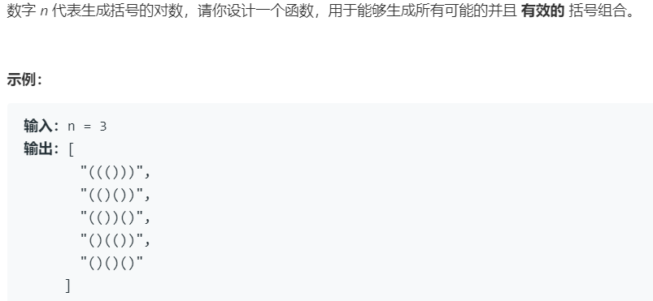

# *22.括号生成 (Medium)

## 题目描述



### 标签

回溯算法

## 思路 & 代码

又是回溯，套模板就行了，时间复杂度为卡塔兰数 $C_n = \frac{1}{n + 1} \binom{2n}{n}$，这个数很有意思，比如给定 1 到 n 的入栈序列，合法的出栈序列数目也是卡塔兰数，括号匹配跟栈差不多。卡塔兰数渐近表示为 $C_n \sim \frac{4^n}{n^{3/2}\sqrt{\pi}}$。

另一种思路，首个字符肯定是左括号，然后当向后添加直到第一次左右括号平衡时，记右括号位置为 cur，那么 1 ~ cur - 1 之间的一定是合法的序列，cur + 1 ~ 2n - 1 也是合法序列。共 n 组括号，1 到 cur - 1 之间有 a 组，cur + 1 到 2n - 1 之间是 n - 1 - a 组，而每个合法序列都会有一个唯一的 cur，因此对 n 组括号的所有序列，只需知道 a 组括号以及 n - 1 - a 组括号的所有序列，然后两两组合即可。

```c++ tab="回溯"
class Solution {
public:
    vector<string> generateParenthesis(int n) {
        vector<string> res;
        if(n == 0) {
            return res;
        }
        backtrack(res, 0, 0, n, "");
        return res;     
    }
    void backtrack(vector<string>& res, int l, int r, int n, string path) {
        if(path.length() == 2 * n) {
            res.push_back(path);
            return;
        }
        if(l < n) {
            backtrack(res, l + 1, r, n, path + "(");
        }
        if(r < l) {
            backtrack(res, l, r + 1, n, path + ")");
        }
    }
};
```

```c++ tab="长度递归"
class Solution {
    shared_ptr<vector<string>> cache[100] = {nullptr};
public:
    shared_ptr<vector<string>> generate(int n) {
        if (cache[n] != nullptr)
            return cache[n];
        if (n == 0) {
            cache[0] = shared_ptr<vector<string>>(new vector<string>{""});
        } else {
            auto result = shared_ptr<vector<string>>(new vector<string>);
            for (int i = 0; i != n; ++i) {
                auto lefts = generate(i);
                auto rights = generate(n - i - 1);
                for (const string& left : *lefts)
                    for (const string& right : *rights)
                        result -> push_back("(" + left + ")" + right);
            }
            cache[n] = result;
        }
        return cache[n];
    }
    vector<string> generateParenthesis(int n) {
        return *generate(n);
    }
};
```

```c++ tab="dp"
class Solution {
public:
    vector<string> generateParenthesis(int n) {
        vector<string> res;
        if(n == 0) {
            return res;
        }
        vector<vector<string>> dp(n + 1);
        dp[0] = { "" };
        dp[1] = { "()" };
        for(int i = 2; i <= n; i++) {
            for(int j = 0; j < i; j++) {
                for(auto& p : dp[j]) {
                    for(auto& q : dp[i - j - 1]) {
                        dp[i].push_back("(" + p + ")" + q);
                    }
                }
            }
        }
        return dp[n];
    }
};
```