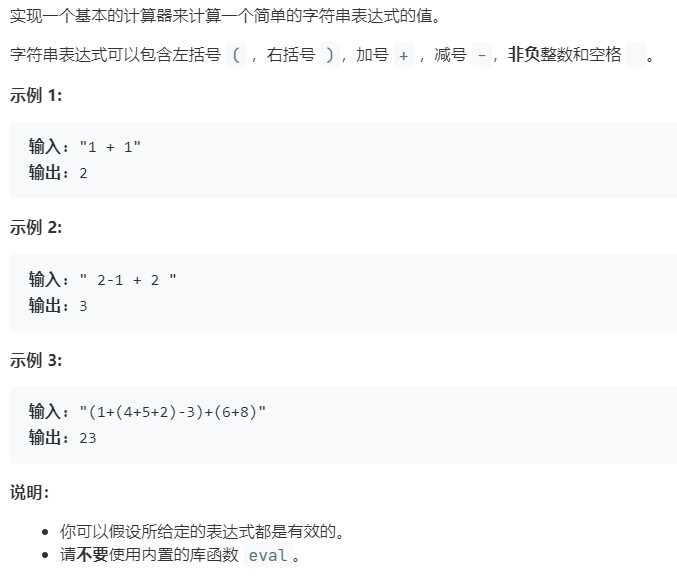

# 224.基本计算器 (Hard)

## 题目描述



## 思路 & 代码

这种表达式求值一般都用栈实现，只有加减和括号还是比较容易实现的。加减统一用符号，最后都是加。

```c++
class Solution {
public:
    int calculate(string s) {
        stack<int> st;
        int res = 0, n = s.size(), sign = 1;
        for(int i = 0; i < n; i++) {
            int num = 0;
            if(s[i] >= '0' && s[i] <= '9') {
                while(i < n && s[i] >= '0' && s[i] <= '9') {
                    num = num * 10 + (s[i] - '0');
                    i++;
                }
                i--;
                res += sign * num;
            }else if(s[i] == '+') {
                sign = 1;
            }else if(s[i] == '-') {
                sign = -1;
            }else if(s[i] == '(') {
                st.push(res);
                st.push(sign);
                res = 0;
                sign = 1;
            }else if(s[i] == ')') {
                res *= st.top();
                st.pop();
                res += st.top();
                st.pop();
            }
        }
        return res;
    }
};
```