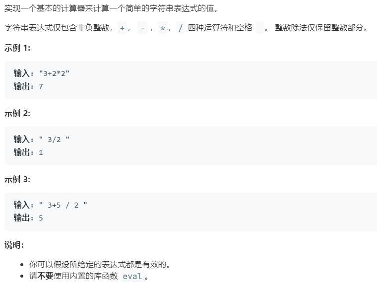

# 227.基本计算器 II (Medium)

## 题目描述



## 思路 & 代码

一步步考虑如何实现一个基本的计算器。

1. 最基本的就是字符串转整数，按序读字符累加；
2. 然后实现加减法，将符号和值入栈，最后累加；
3. 乘除其实也比较容易，只要直接与当前栈顶值运算再入栈即可；
4. 最后处理括号，只要将括号中内容视为一个值。

```c++
class Solution {
public:
    int calculate(string s) {
        int n = s.length();
        int num = 0;
        char sign = '+';
        stack<int> st;
        for(int i = 0; i < n; i++) {
            auto& c = s[i];
            if(isdigit(c)) {
                num = num * 10 + (c - '0');
            }
            if(!isdigit(c) && c != ' ' || i == n - 1){
                switch(sign) {
                    int pre;
                    case '+':
                        st.push(num);
                        break;
                    case '-':
                        st.push(-1 * num);
                        break;
                    case '*':
                        pre = st.top();
                        st.pop();
                        st.push(num * pre);
                        break;
                    case '/':
                        pre = st.top();
                        st.pop();
                        st.push(pre / num);
                        break;
                }
                sign = c;
                num = 0;
            }
        }
        int res = 0;
        while(!st.empty()) {
            res += st.top();
            st.pop();
        }
        return res;
    }
};
```