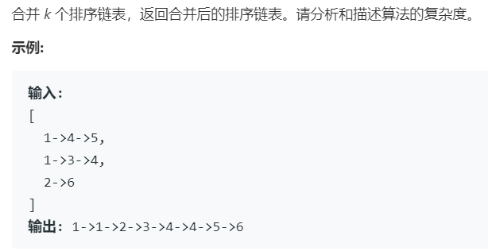

# 23.合并 K 个排序链表 (Hard)

## 题目描述



### 标签

堆；链表；分治算法

## 思路 & 代码

之前做过合并两个有序链表，一个个比较就行，根据 K 个链表头大小串联，每次选出最小的一个连起来。理所当然可以想到分治，就类似于归并排序的合并阶段。时间复杂度 $O(n\log K)$。

```c++
class Solution {
public:
    struct cmp {
        bool operator()(const ListNode *a, const ListNode *b) {
            return a->val > b->val;
        }
    };
    ListNode* mergeKLists(vector<ListNode*>& lists) {
        priority_queue<ListNode*, vector<ListNode*>, cmp> pq;
        for(auto p : lists) {
            if(p != nullptr) {
                pq.push(p);
            }
        }
        auto newHead = new ListNode(-1);
        auto p = newHead;
        while(!pq.empty()) {
            auto cur = pq.top();
            pq.pop();
            p->next = cur;
            p = cur;
            if(cur->next != nullptr) {
                pq.push(cur->next);
            }
        }
        return newHead->next;
    }
};
```