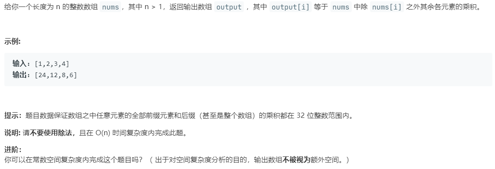

# 238.除自身以外数组的乘积 (Medium)

## 题目描述



## 思路 & 代码

除 nums[i] 外数组元素的乘积应该是左侧元素乘积×右侧元素乘积，所以我们只要维护 l 和 r 两个前缀/后缀积。

```c++
class Solution {
public:
    vector<int> productExceptSelf(vector<int>& nums) {
        int n = nums.size();
        vector<int> res(n, 1);
        int left = 1, right = 1;
        for(int i = 0; i < n; i++) {
            res[i] *= left;
            left *= nums[i];
            res[n - 1 - i] *= right;
            right *= nums[n - 1 - i];
        }
        return res;
    }
};
```