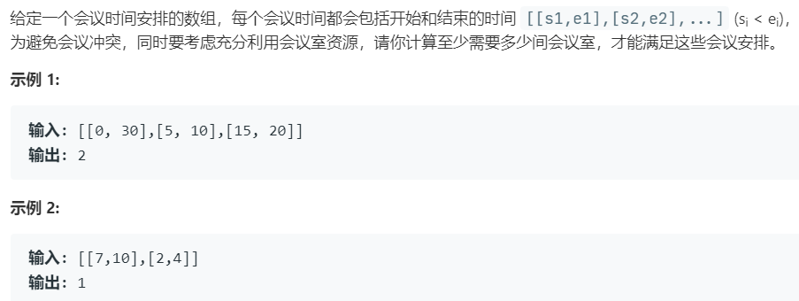

# 253.会议室 II (Medium)

## 题目描述



## 思路 & 代码

上一个题把会议映射到时间轴，然后遍历获取当前的会议数，我们只要获取最大值就行了。

或者维护一个最小堆，存入会议的结束时间，当堆顶时间在当前会议时间之后时说明时间冲突。

```c++ tab="时间轴"
class Solution {
public:
    int minMeetingRooms(vector<vector<int>>& inters) {
        map<int, int> times;
        for(auto inter : inters) {
            times[inter[0]]++;
            times[inter[1]]--;
        }
        int cur = 0;
        int res = 0;
        for(auto t : times) {
            cur += t.second;
            res = max(res, cur);
        }
        return res;
    }
};
```

```c++ tab="堆"
class Solution {
public:
    int minMeetingRooms(vector<vector<int>>& intervals) {
        if(intervals.size() == 0) {
            return 0;
        }
        sort(intervals.begin(), intervals.end(), [&](const vector<int>& a, const vector<int>& b) -> int {
            return (a[0] == b[0] ? a[1] < b[1] : a[0] < b[0]);
        });
        priority_queue<int, vector<int>, greater<int>> pq;
        pq.push(0);
        for(auto& inter : intervals) {
            int curStart = inter[0];
            int curEnd = inter[1];
            int last = pq.top();
            if(last <= curStart) {
                pq.pop();
            }
            pq.push(curEnd);
        }
        return pq.size();
    }
};
```
