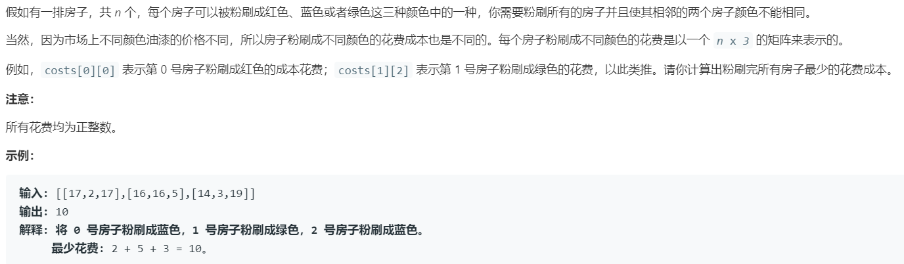

# 256.粉刷房子 (Easy)

## 题目描述



### 标签

动态规划；

## 思路 & 代码

> “一瞅就 dp，一写就不会” ———— caijiqhx

dp 的流程就是定义状态，确定转移方程，确定初态。具体有以下几步：

dp[i] 的定义，大概有几种，跟前一步相关、跟前面 n 步相关、dp[i] 还需要细分以及二维三维 dp。如果套不上那可能就得重新定义。 

之后确定状态转移，一般比较简单，之后需要考虑初始化、边界等细节。

这个题，dp[i] 表示刷到第 i 个房子的最小花费，如果没限制颜色不同，那状态方程可能是这样 dp[i] = min(cost[i][0], cost[i][1], cost[i][2]) + dp[n - 1];，这里我们并不知道前一个房子刷的是什么颜色，dp[i][j] 表示第 i 个房子刷 j 颜色时的最小花费，j = 0, 1, 2，那么就有 dp[i][0] = cost[i][0] + min(dp[i - 1][1], dp[i - 1][2]); 而且只需要前一步数据，所以就用三个变量存刷三个颜色的最小花费即可。

```c++ tab="dp"
class Solution {
public:
    int minCost(vector<vector<int>>& costs) {
        int len = costs.size();
        if(len == 0) {
            return 0;
        }
        int redCost = 0, blueCost = 0, greenCost = 0;
        int res = INT_MAX;
        for(int i = 0; i < len; i++) {
            int curRed = min(blueCost, greenCost) + costs[i][0];
            int curBlue = min(redCost, greenCost) + costs[i][1];
            int curGreen = min(blueCost, redCost) + costs[i][2];
            redCost = curRed;
            blueCost = curBlue;
            greenCost = curGreen;
        }
        res = min(redCost, min(blueCost, greenCost));
        return res;
    }
};
```

