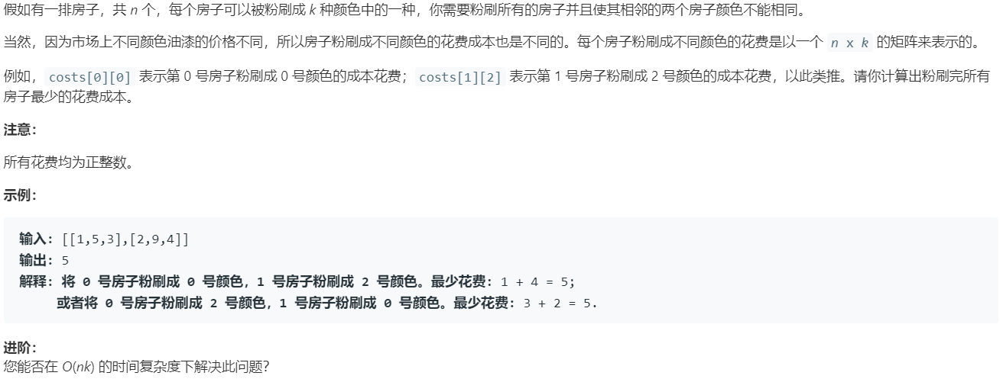

# 265.粉刷房子 II (Hard)

## 题目描述



### 标签

动态规划；

## 思路 & 代码

之前做过三种颜色的，需要记录除上一个房子除本颜色外的最小花费，k 个的话找到最小的需要时间复杂度 $O(k)$，同时这里不能只用一个数组表示了，用两个数组滚动更新。

优化应该就在取最小值上，我们可以对 k 种颜色每种都存最小的两个 cost，同时还要保存花费对应的颜色。这样可以选择除本颜色外的最小颜色。但其实再想一下，我们每轮可能用到的上一轮的值其实就俩，最小花费及其颜色，以及第二小的花费，这样就完全满足了更新条件。时间复杂度 $O(nk)$，空间复杂度 $O(1)$。

```c++ tab="dp"
class Solution {
public:
    int minCostII(vector<vector<int>>& costs) {
        int n = costs.size();
        if(n == 0) {
            return 0;
        }
        int k = costs[0].size();
        if(k == 0) {
            return 0;
        }
        if(n == 1 && k == 1) {
            return costs[0][0];
        }
        vector<vector<int>> dp(2, vector<int>(k, 0));
        
        for(int i = 0; i < n; i++) {
            for(int j = 0; j < k; j++) {
                int curMin = (j == 0 ? dp[0][1] : dp[0][0]);
                for(int t = 0; t < k; t++) {
                    if(t != j && dp[0][t] < curMin) {
                        curMin = dp[0][t];                
                    }
                }
                dp[1][j] = curMin + costs[i][j];
            }
            for(int j = 0; j < k; j++) {
                dp[0][j] = dp[1][j];
            }
        }
        return *min_element(dp[1].begin(), dp[1].end());
    }
};
```

```c++ tab="dp 优化"
class Solution {
public:
    int minCostII(vector<vector<int>>& costs) {
        int n = costs.size();
        if(n == 0) {
            return 0;
        }
        int k = costs[0].size();
        if(k == 0) {
            return 0;
        }
        if(n == 1 && k == 1) {
            return costs[0][0];
        }
        int minColor = -1;
        int minCost = 0;
        int secondMinCost = 0;
        for(int i = 0; i < n; i++) {
            int curMinColor = -1;
            int curMinCost = INT_MAX;
            int curSecondMinCost = INT_MAX;
            for(int j = 0; j < k; j++) {
                int tmp = costs[i][j] + (j == minColor ? secondMinCost : minCost);

                if(tmp < curMinCost) {
                    curSecondMinCost = curMinCost;
                    curMinCost = tmp;
                    curMinColor = j;
                }else if(tmp < curSecondMinCost) {
                    curSecondMinCost = tmp;
                }
            }
            minCost = curMinCost;
            minColor = curMinColor;
            secondMinCost = curSecondMinCost;
        }
        return minCost;
    }
};
```