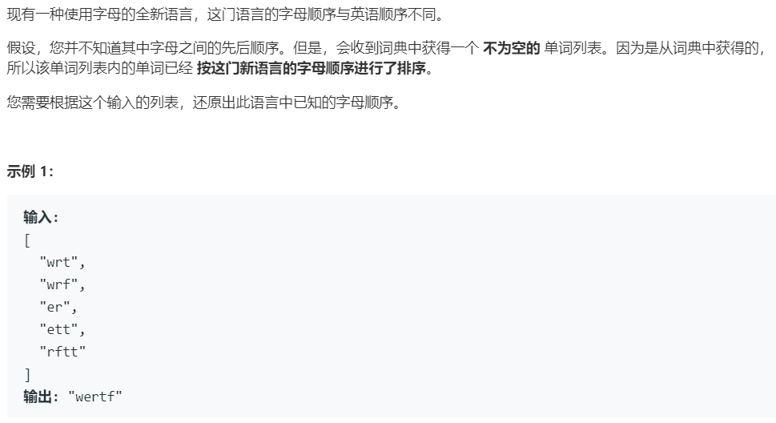

# 269.火星词典 (Hard)

## 题目描述



### 标签

图论；拓扑排序；

## 思路 & 代码

> 默认小写。顺序不合法则返回空串，多种合法顺序返回任一。

相邻两个字符串找到第一个不同的字符就得到了这两个字符的关系。先根据这个顺序关系构建图，然后再进行拓扑排序输出。从来没实现过拓扑排序，也比较简单，就是每次选入度为 0 的节点移除，知道访问到所有结点或不存在入度为 0 的节点。

```c++ tab="拓扑排序"
class Solution {
private:
    size_t letters = 26;
public:
    string alienOrder(vector<string>& words) {
        int n = words.size();
        if(n == 0) {
            return "";
        }
        // 构造图的邻接表，入度表
        vector<int> in_degree(letters, 0);
        vector<unordered_set<char>> graph(letters, unordered_set<char>());
        unordered_set<char> seen_letters(words[n - 1].begin(), words[n - 1].end());
        for(int i = 0; i < n - 1; i++) {
            seen_letters.insert(words[i].begin(), words[i].end());
            int idx = 0;
            int curLen = words[i].length();
            int nextLen = words[i + 1].length();
            while(idx < curLen && idx < nextLen) {
                char& from = words[i][idx];
                char& to = words[i + 1][idx];
            
                if(from != to) {
                    if(graph[from - 'a'].count(to) == 0) {
                        in_degree[to - 'a']++;
                        graph[from - 'a'].insert(to);
                    }
                    break;
                }
                idx++;
            }
            if(idx == nextLen && curLen > nextLen) {
                cout << words[i] << " " << words[i + 1] << endl;
                return "";
            }
        }
        // 拓扑排序
        queue<char> q;
        string res = "";
        for(int i = 0; i < letters; i++) {
            if(seen_letters.count(i + 'a')) {
                if(in_degree[i] == 0) {
                    q.push(i + 'a');
                    res += i + 'a';
                }
            }else {
                in_degree[i] = -1;
            }
        }
        while(!q.empty()) {
            int len = q.size();
            while(len--) {
                char& from = q.front();
                q.pop();
                for(auto& to : graph[from - 'a']) {
                    if(in_degree[to - 'a'] == 1) {
                        q.push(to);
                        res += to;
                    }
                    in_degree[to - 'a']--;
                }
            }
        }
        // cout << res << endl;
        if(res.length() != seen_letters.size()) {
            return "";
        }
        return res;
    }
};
```

