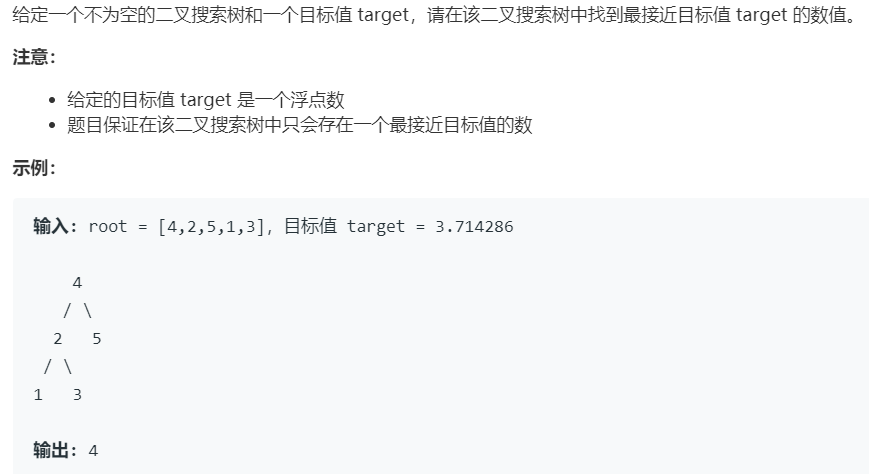

# 270.最接近的二叉搜索树 (Easy)

## 题目描述



### 标签

二分查找；

## 思路 & 代码

二叉树，定义区间 [l, r]，根据当前节点与 target 的大小关系决定搜索方向。
 
```c++ tab="二分搜索"
class Solution {
public:
    int closestValue(TreeNode* root, double target) {
        int l = root->val, r = root->val;
        auto cur = root;
        while(cur != nullptr) {
            if(target < cur->val) {
                r = cur->val;
                cur = cur->left;
            }else if(target > cur->val) {
                l = cur->val;
                cur = cur->right;
            }else {
                return cur->val;
            }
        }
        return abs(target - l) < abs(target - r) ? l : r;
    }
};
```