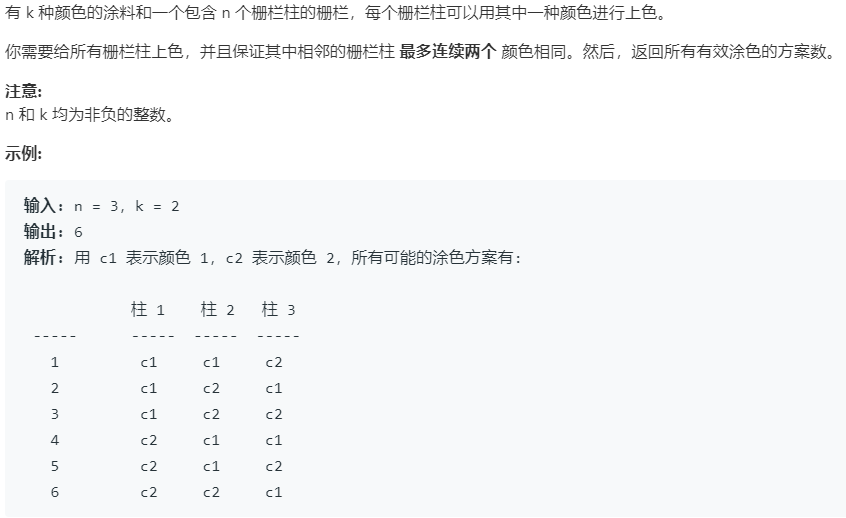

# 276.栅栏涂色 (Easy)

## 题目描述



### 标签

动态规划；

## 思路 & 代码

乍一看好像跟刷房子那个差不多，结果细瞅看到了 “最多连续两个颜色相同”。mmp 感觉要麻烦一点。不过还好这个是要求方案数，应该还是比较简单的。

有两种思路，第一种是看第 i 个栅栏跟第 i - 1 个颜色是否相同，如果相同的情况应该有 [i - 2] * (k - 1) 种，即 i - 2 个栅栏的颜色应该跟当前颜色不同。不同的情况有 [i - 1] * (k - 1) 种。所有就有 dp[i] = (dp[i - 1] + dp[i - 2]) * (k - 1)。

第二种思路是第 i 个栅栏的颜色取决于前两个 i - 1 和 i - 2 是否相同，相同则 i 有 k - 1 种可能，不相同则有 k 种可能。这种感觉想起来简单但是实现很麻烦，i 栅栏的情况数由 same + diff 两部分组成，same[i] = diff[i - 1]，即 i 栅栏的前两个元素相同等价于 i - 1 的前两个元素不同，diff[i] = (same[i - 1] + diff[i - 1]) * (k - 1)，总的加起来就是 dp[i] = same[i - 1] * (k - 1) + diff[i - 1] * k。其实我现在还是不太明白怎么解释这种定义。。。

```c++ tab="dp"
class Solution {
public:
    int numWays(int n, int k) {
        if(n == 0 || k == 0) {
            return 0;
        }
        if(n == 1) {
            return k;
        }
        int i_1 = k * k;
        int i_2 = k;
        int res = k * k;
        for(int i = 2; i < n; i++) {
            res = i_1 * (k - 1) + i_2 * (k - 1);
            i_2 = i_1;
            i_1 = res;
        }
        return res;
    }
};
```

```c++ tab="dp 思路二"
class Solution {
public:
    int numWays(int n, int k) {
        if (n == 0 || k == 0) {
            return 0;
        }
        if (n == 1) {
            return k;
        }
        int diff_color = k * (k - 1);
        int same_color = k;
        for (int i = 2; i < n; ++i) {
            int temp = diff_color;
            diff_color = (diff_color + same_color) * (k - 1);
            same_color = temp;
        }
        return same_color + diff_color;
    }
};
```