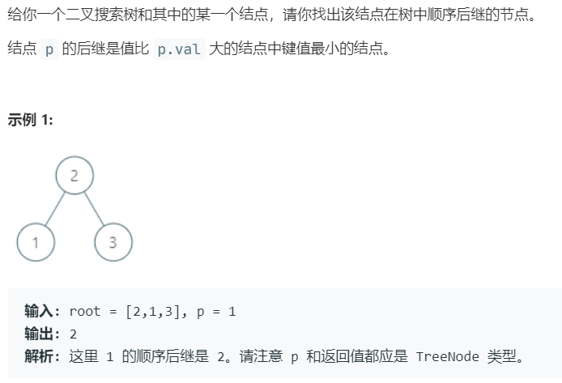

# 285.二叉搜索树中的顺序后继 (Medium)

## 题目描述



### 标签

二叉搜索树；

## 思路 & 代码

顺序后继就是中序的下一个结点，如果 p 有右结点，那么后继结点就是右子树的最左结点，没有右结点，就需要从根节点开始中序遍历，记录前驱结点值，前驱为 p->val 时返回。

```c++
class Solution {
public:
    TreeNode* inorderSuccessor(TreeNode* root, TreeNode* p) {
        if(root == nullptr || p == nullptr) {
            return nullptr;
        }
        if(p->right != nullptr) {
            auto cur = p->right;
            while(cur->left != nullptr) {
                cur = cur->left;
            }
            return cur;
        }else {
            stack<TreeNode*> st;
            auto cur = root;
            long prev = LONG_MIN;
            while(cur != nullptr || !st.empty()) {
                while(cur != nullptr) {
                    st.push(cur);
                    cur = cur->left;
                }
                cur = st.top();
                st.pop();
                if(prev == p->val) {
                    return cur;
                }
                prev = cur->val;
                cur = cur->right;
            }
        }
        return nullptr;
    }
};
```