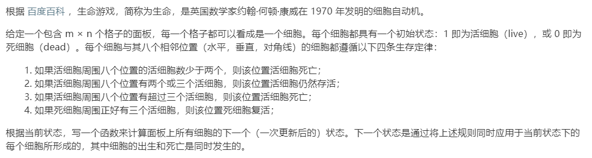

# 289.生命游戏 (Medium)

## 题目描述



## 思路 & 代码

两次遍历，第一次标记，第二次修改。可以使用第 2 位标记，修改的时候右移覆盖原数据。

```c++
class Solution {
public:
    int fourSumCount(vector<int>& A, vector<int>& B, vector<int>& C, vector<int>& D) {
        int n = A.size();
        int res = 0;
        if(n == 0) {
            return res;
        }
        unordered_map<int, int> sumMap;
        for(int i = 0; i < n; i++) {
            for(int j = 0; j < n; j++) {
                sumMap[A[i] + B[j]]++;
            }
        }
        for(int i = 0; i < n; i++) {
            for(int j = 0; j < n; j++) {
                int tar = - (C[i] + D[j]);
                if(sumMap.count(tar)) {
                    res += sumMap[tar];
                }
            }
        }
        return res;
    }
};
```