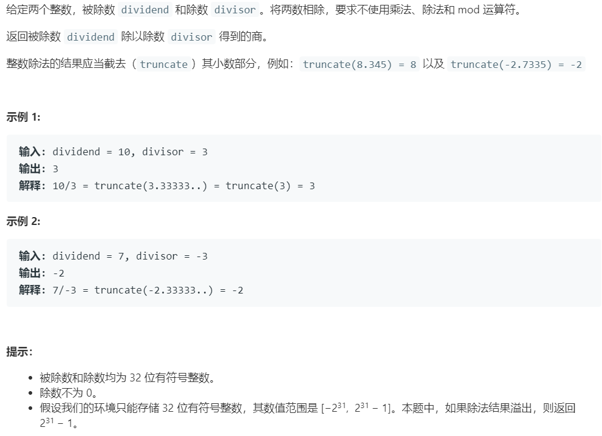

# 29.两数相除 (Medium)

## 题目描述



### 标签

二分查找；

## 思路 & 代码

模拟除法的过程，首先要确定符号，同时处理特殊值。除的过程就是对能减就倍增，不能减就对剩余的部分递归地除。

```c++
class Solution {
private:
    int div(int a, int b) {
        if(a < b) {
            return 0;
        }
        int res = 1;
        int acc = b;
        // 能减就倍增
        while(a - acc >= acc) {
            res += res;
            acc += acc;
        }
        return res + div(a - acc, b);
    }
public:
    int divide(int dividend, int divisor) {
        // 先考虑可能溢出的情况
        if(dividend == 0) {
            return 0;
        } else if(divisor == 1) {
            return dividend;
        } else if(divisor == -1) {
            return dividend == INT_MIN ? INT_MAX : -dividend;
        }
        int a = dividend, b = divisor;
        int res = 0;
        bool sign = (a > 0 && b > 0 || a < 0 && b < 0);
        if(b == INT_MIN) {
            return (a == INT_MIN ? 1 : 0);
        }
        if(a == INT_MIN) {
            // 不能直接转为整数
            a = sign ? a - b : a + b;
            res++;
        }
        if(a < 0) {
            a = -a;
        }
        if(b < 0) {
            b = -b;
        }
        res += div(a, b);
        return (sign ? 1 : -1) * res;
    }
};
```