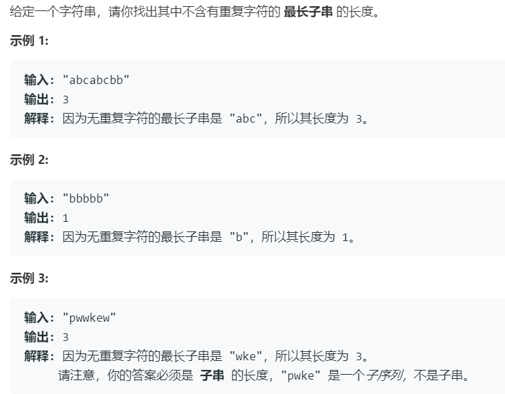

# 3.无重复字符的最长子串 (Medium)

## 题目描述



## 思路 & 代码

看题应该就是双指针，向右扩展到有重复再向左缩减。

```c++ tab="双指针"
class Solution {
public:
    int lengthOfLongestSubstring(string s) {
        int res = 0;
        int len = s.length();
        if(len == 0) {
            return res;
        }
        vector<int> cnt(128, 0);
        int l = 0, r = 0;
        while(r < len) {
            char c = s[r];
            cnt[c]++;
            while(cnt[c] > 1) {
                cnt[s[l]]--;
                l++;
            }
            r++;
            if(r - l > res) {
                res = r - l;
            }
        }
        return res;
    }
};
```