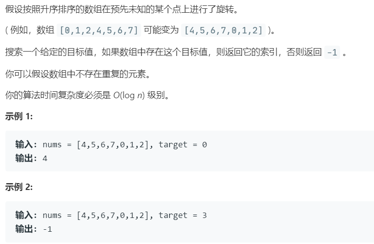

# 33.搜索旋转排序数组 (Medium)

## 题目描述



### 标签

二分查找；

## 思路 & 代码

要求 $O(\log n)$ 那就是二分，不仅要比较 target 的 mid，还要比较 mid 和边界的关系。

总结出向左归约 `r = mid - 1` 的几种情况即可，一共就几种情况：

- `nums[l] <= nums[mid]`，即左侧为有序，旋转点在右，此时仅当 `nums[l] <= target < nums[mid]` 时；
- `nums[l] > nums[mid]`，即旋转点在左，当 `target >= nums[l] || target < nums[mid]` 时向左归约，对应目标值在旋转点前后。

```c++ tab="二分查找"
class Solution {
public:
    int search(vector<int>& nums, int target) {
        int n = nums.size();
        int l = 0, r = n - 1;
        while(l <= r) {
            int mid = l + (r - l) / 2;
            if(target == nums[mid]) {
                return mid;
            }else if((nums[l] <= nums[mid] && nums[l] <= target && target < nums[mid]) ||
                (nums[l] > nums[mid] && (target >= nums[l] || target < nums[mid]))) {
                r = mid - 1;
            }else {
                l = mid + 1;
            }
        }
        return -1;
    }
};
```