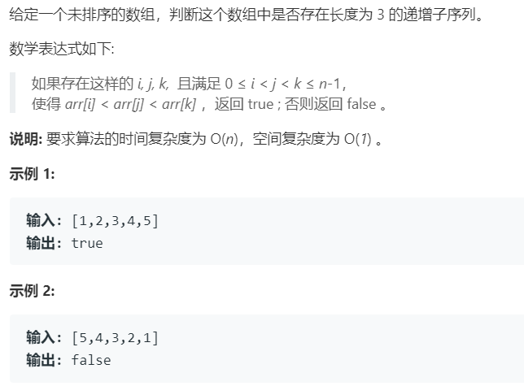
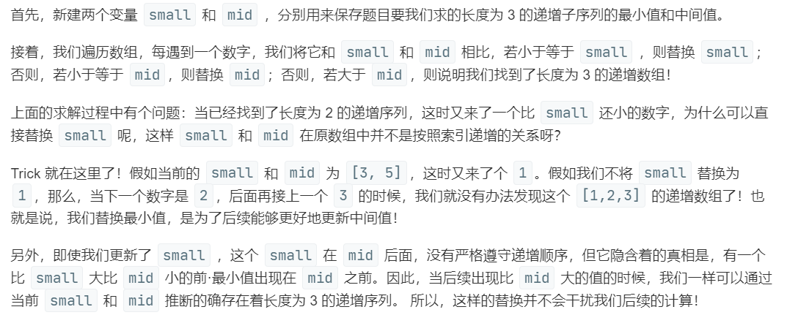

# 334.递增的三元子序列 (Medium)

## 题目描述



## 思路 & 代码

题解里有位带哥写得实在是太好了，我直接 copy 吧：



```c++
class Solution {
public:
    bool increasingTriplet(vector<int>& nums) {
        int n = nums.size();
        if(n < 3) {
            return false;
        }
        int min = INT_MAX, second = INT_MAX;
        for(auto& num : nums) {
            if(num <= min) {
                min = num;
            }else if(num < second) {
                second = num;
            }else if(num > second){
                return true;
            }
        }
        return false;
        
    }
};
```