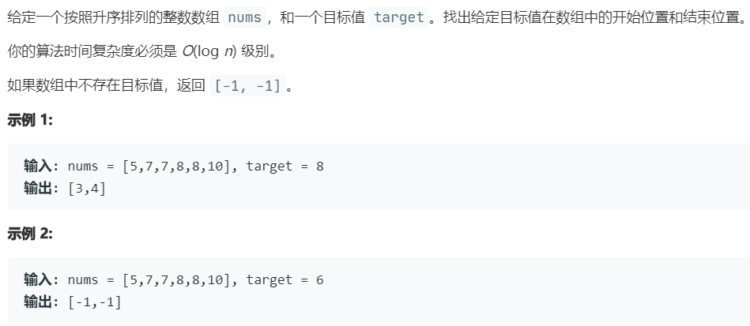

# 34.在排序数组中查找元素的第一个和最后一个位置 (Medium)

## 题目描述



### 标签

二分查找；

## 思路 & 代码

经典的二分检索左右边界，检索区间为 [l, r)。

```c++ tab="二分"
class Solution {
public:
    vector<int> searchRange(vector<int>& nums, int target) {
        vector<int> res(2);
        int n = nums.size();
        int l = 0, r = n;
        while(l < r) {
            int mid = l + (r - l) / 2;
            if(nums[mid] >= target) {
                r = mid;
            }else {
                l = mid + 1;
            }
        }
        if(l == n || nums[l] != target) {
            return {-1, -1};
        }
        res[0] = l;
        l = 0, r = n;
        while(l < r) {
            int mid = l + (r - l) / 2;
            if(nums[mid] > target) {
                r = mid;
            }else {
                l = mid + 1;
            }
        }
        res[1] = l - 1;
        return res;
    }
};
```