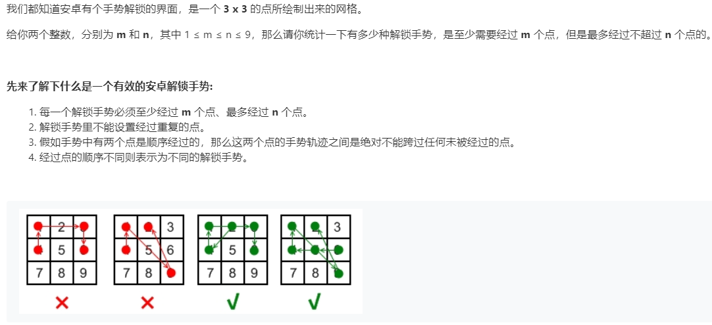

# 351.安卓系统手势解锁 (Medium)

## 题目描述

### 标签

动态规划；回溯算法；

## 思路 & 代码

看着就挺像回溯的，回溯的框架就是做出选择，符合条件后加入结果，遍历决策树的过程。

不过突然看到一个条件 “假如手势中有两个点是顺序经过的，那么这两个点的手势轨迹之间是绝对不能跨过任何未被经过的点"，这个意思就是可以跨过已被经过的点呗。就像示例的第 4 个，9 -> 2 跨过了 5, 6。不过还好这种点应该很少，毕竟就 3 × 3。

1, 3, 7, 9 以及 2, 4, 6, 8 都是对称的，5 是单独的，所以算 3 组就行了。

算法的步骤大概就是选择下一个未访问数字，需要满足的条件有几点：

1. 两个数字相邻或成日字对角线，这种情况我们可以发现两数之和为奇数。
2. 两数的中间元素已被访问过，这种就像 1, 9，需要 5 访问过才能连。
3. 两数对角线相邻。

满足任一条件即可加入路径，路径长度进入 [m, n] 则计数。

