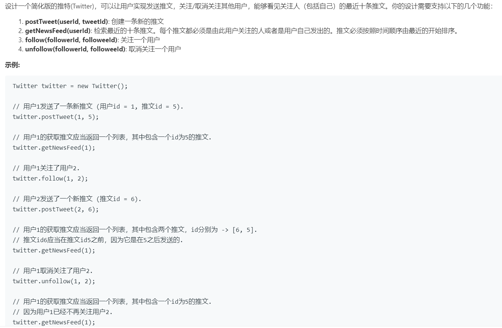

# 355.设计推特 (Medium)

## 题目描述



### 标签

堆；哈希表；

## 思路 & 代码

首先肯定得保存用户，然后保存用户的关注列表，还要保存用户的推文和维护一个最近十条推文列表。

关注列表可以用哈希表，推文要根据时间排序，得添加一个时间戳。然后每个用户发的推文可以用单链表，或者就用数组也行。每次获取推文的时候就应该按照时间戳合并该用户和关注用户的推文。

大概是使用面向对象的思想，封装了推文和用户。出现的问题就是开始想把时间戳放在 Twitter 内部声明为静态成员变量，但这时候似乎内部结构体对时间戳的访问出问题了，所以就把时间戳提到全局变量了。

```c++
int timeStamp = 0;             // 公用时间戳
class Twitter {
private:
    // 推文
    struct Tweet {
        int id;                         // 推文 id
        int time;                       // 推文时间戳
        Tweet *next;                    // 下一个推文
        Tweet(int _id, int _time) : id(_id), time(_time), next(nullptr) {}
        bool operator<(const Tweet& a) const {
            return a.time > time;
        }
    };
    // 用户
    struct User {
        int id;                         // 用户 id
        unordered_set<int> following;   // 用户关注列表
        Tweet *postHead;                // 用户的推文列表
        User(int _id) : id(_id), postHead(nullptr){
            follow(id);                 // 关注自己
        }
        // 添加关注
        void follow(int userId) {
            following.insert(userId);
        }
        // 取消关注
        void unFollow(int userId) {
            if(following.count(userId) && userId != id) {
                following.erase(userId);
            }
        }
        // 发推文，后发的在前
        void postTweet(int tweetId) {
            timeStamp++;
            auto twt = new Tweet(tweetId, timeStamp);
            twt->next = postHead;
            postHead = twt;
        }
    };
    unordered_map<int, User*> userCache;     // userId 映射到 User 结构体
public:
    /** Initialize your data structure here. */
    Twitter() {
        timeStamp = 0;
    }
    
    /** Compose a new tweet. */
    void postTweet(int userId, int tweetId) {
        if(!userCache.count(userId)) {
            userCache[userId] = new User(userId);
        }
        auto cur = userCache[userId];
        cur->postTweet(tweetId);
    }
    
    /** Retrieve the 10 most recent tweet ids in the user's news feed. Each item in the news feed must be posted by users who the user followed or by the user herself. Tweets must be ordered from most recent to least recent. */
    vector<int> getNewsFeed(int userId) {
        vector<int> res;
        if(!userCache.count(userId)) {
            return res;
        }
        auto cur = userCache[userId];
        auto users = cur->following;
        priority_queue<Tweet> pq;
        for(auto cur : users) {
            auto twt = userCache[cur]->postHead;
            if(twt == nullptr) {
                continue;
            }
            pq.push(*twt);
        }
        while(!pq.empty()) {
            if(res.size() == 10) {
                break;
            }
            auto twt = pq.top();
            pq.pop();
            res.push_back(twt.id);
            if(twt.next != nullptr) {
                pq.push(*(twt.next));
            }
        }
        return res;
    }
    
    /** Follower follows a followee. If the operation is invalid, it should be a no-op. */
    void follow(int followerId, int followeeId) {
        if(!userCache.count(followerId)) {
            userCache[followerId] = new User(followerId);
        }
        if(!userCache.count(followeeId)) {
            userCache[followeeId] = new User(followeeId);
        }
        auto cur = userCache[followerId];
        cur->follow(followeeId);
    }
    
    /** Follower unfollows a followee. If the operation is invalid, it should be a no-op. */
    void unfollow(int followerId, int followeeId) {
        if(userCache.count(followerId)) {
            auto cur = userCache[followerId];
            cur->unFollow(followeeId);
        }
    }
};
```