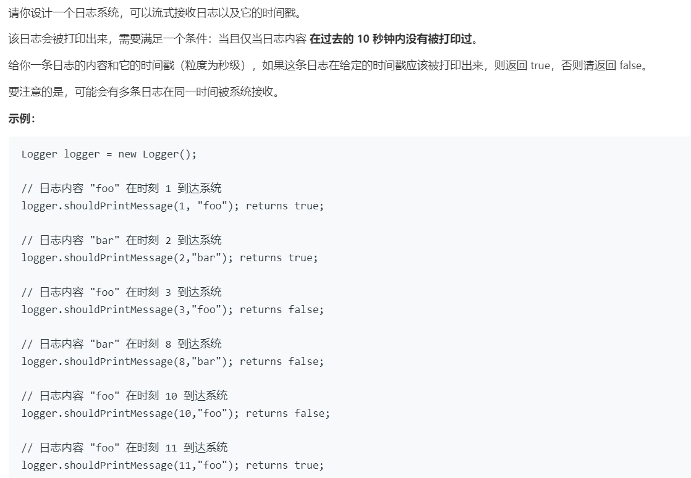

# 359.日志速率限制器 (Easy)

## 题目描述



## 思路 & 代码

比较简单，就以日志字符串为键值存入哈希表，判断时间戳。不过问题就是这样不会删除过期的日志。

```c++
class Logger {
private:
    unordered_map<string, int> logCache;
public:
    /** Initialize your data structure here. */
    Logger() { }
    
    /** Returns true if the message should be printed in the given timestamp, otherwise returns false.
        If this method returns false, the message will not be printed.
        The timestamp is in seconds granularity. */
    bool shouldPrintMessage(int timestamp, string message) {
        if(!logCache.count(message) || timestamp - logCache[message] >= 10) {
            logCache[message] = timestamp;
            return true;
        }
        return false;
    }
};
```