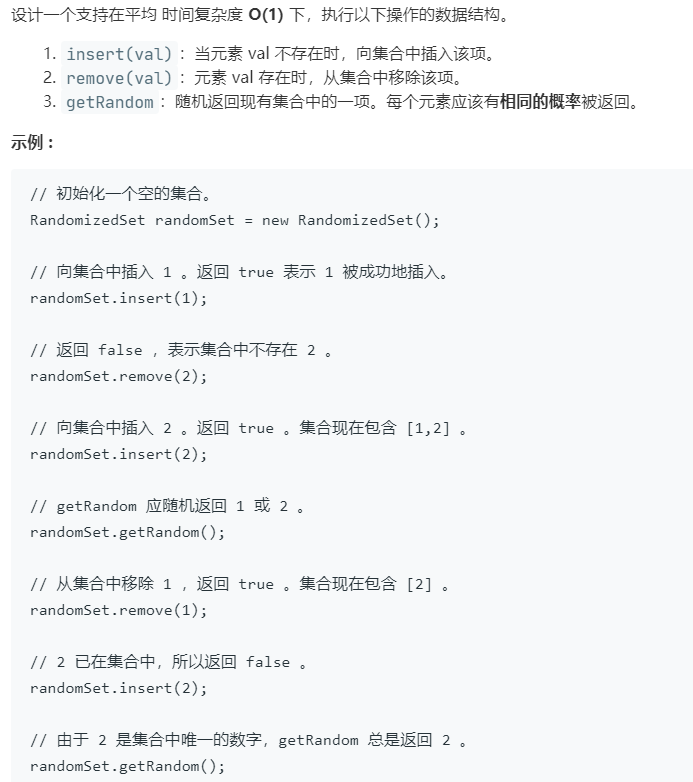

# 380.常数时间插入、删除和获取随机元素 (Medium)

## 题目描述



### 标签

哈希表；

## 思路 & 代码

vector 存值，哈希表记录值和对应下标。

```c++
class RandomizedSet {
private:
    vector<int> nums;
    unordered_map<int, int> idxMap;
public:
    /** Initialize your data structure here. */
    RandomizedSet() { }
    
    /** Inserts a value to the set. Returns true if the set did not already contain the specified element. */
    bool insert(int val) {
        if(idxMap.count(val)) {
            return false;
        }
        nums.push_back(val);
        idxMap[val] = nums.size() - 1;
        return true;
    }
    
    /** Removes a value from the set. Returns true if the set contained the specified element. */
    bool remove(int val) {
        if(!idxMap.count(val)) {
            return false;
        }
        int last = nums.back();
        idxMap[last] = idxMap[val];
        nums[idxMap[val]] = last;
        nums.pop_back();
        idxMap.erase(val);
        return true;
    }
    
    /** Get a random element from the set. */
    int getRandom() {
        return nums[rand() % nums.size()];
    }
};
```