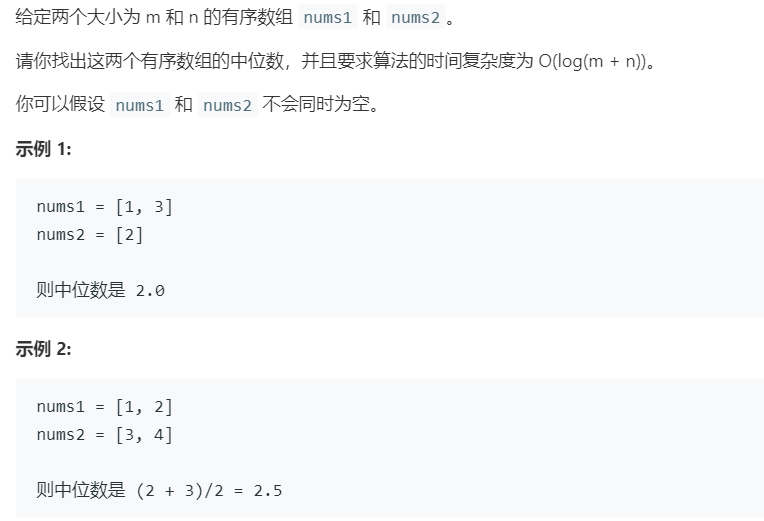

# 4.寻找两个有序数组的中位数 (Hard)

## 题目描述



### 标签

二分查找；分治算法；

## 思路 & 代码

最简单的就是把两个数组合并，求中位数。时间复杂度 $O(m + n)$。稍微优化就是不用完全合并，只需要确定中间位置的元素即可，时间复杂度不变。

题目要达到 $O(\log(m + n))$，看样子得用二分。求中位数其实就是求第 k 大的数，数组是有序的，所以我们可以依次排除很多的数。找两个有序数组合并后第 k 小的数字，就比较 k/2 位置的元素，小的那个它的前 k/2 就可以舍弃了。之后我们再比较之后第 (k - k/2)/2 位置的元素，还是小的舍弃，k = 1 时就找到了。时间复杂度 $O(\log(m + n))$，不过提交结果比前面的慢。。。可能是因为递归。

还有一种思路，中位数其实就是切分数组，如果可以把两个数字分别在 i 和 j 的位置切分，使得左右长度相等或左比右大 1，且左侧最大小于等于右侧最小，那么就找到了中位数，相等时是端点，不等时是左侧端点。检索的时候令 j = (m + n + 1) / 2 - i 即可，此处 +1 是为了奇偶统一处理。时间复杂度 $O(\log(m + n))$，这两个指数的算法提交之后都比最开始的慢。。。

```c++ tab="合并"
class Solution {
public:
    double findMedianSortedArrays(vector<int>& nums1, vector<int>& nums2) {
        int m = nums1.size();
        int n = nums2.size();
        if(m == 0) {
            if(n & 1) {
                return nums2[n / 2];
            }else {
                return (nums2[n / 2 - 1] + nums2[n / 2]) / 2.0;
            }
        }
        if(n == 0) {
            if(m & 1) {
                return nums1[m / 2];
            }else {
                return (nums1[m / 2 - 1] + nums1[m / 2]) / 2.0;
            }
        }
        vector<int> nums(m + n);
        int index = 0;
        int i = 0, j = 0;
        while(index < m + n) {
            if(i == m) {
                while(j < n) {
                    nums[index++] = nums2[j++];
                }
                break;
            }
            if(j == n) {
                while(i < m) {
                    nums[index++] = nums1[i++];
                }
                break;
            }
            if(nums1[i] < nums2[j]) {
                nums[index++] = nums1[i++];
            }else {
                nums[index++] = nums2[j++];
            }
        }
        if(index & 1) {
            return nums[index / 2];
        }else {
            return (nums[index / 2 - 1] + nums[index / 2]) / 2.0;
        }
    }
};
```

```c++ tab="合并 优化"
class Solution {
public:
    double findMedianSortedArrays(vector<int>& nums1, vector<int>& nums2) {
        int m = nums1.size();
        int n = nums2.size();
        int len = m + n;
        int l = -1, r = -1;
        int i = 0, j = 0;
        for(int k = 0; k <= len / 2; k++) {
            l = r;
            if(i < m && (j >= n || nums1[i] < nums2[j])) {
                r = nums1[i++];
            }else {
                r = nums2[j++];
            }
        }
        if(len & 1) {
            return r;
        }else {
            return (l + r) / 2.0;
        }
    }
};
```

```c++ tab="Kth"
class Solution {
private:
    int getKth(vector<int>& nums1, int l1, int r1, vector<int>& nums2, int l2, int r2, int k) {
        int len1 = r1 - l1 + 1;
        int len2 = r2 - l2 + 1;
        if(len1 > len2) {
            return getKth(nums2, l2, r2, nums1, l1, r1, k);
        } 
        if(len1 == 0) {
            return nums2[l2 + k - 1];
        }
        if(k == 1) {
            return min(nums1[l1], nums2[l2]);
        }
        int i = l1 + min(len1, k / 2) - 1;
        int j = l2 + min(len2, k / 2) - 1;
        if(nums1[i] > nums2[j]) {
            return getKth(nums1, l1, r1, nums2, j + 1, r2, k - (j - l2 + 1));
        }else {
            return getKth(nums1, i + 1, r1, nums2, l2, r2, k - (i - l1 + 1));
        }
    }
public:
    double findMedianSortedArrays(vector<int>& nums1, vector<int>& nums2) {
        int m = nums1.size();
        int n = nums2.size();
        int len = m + n;
        int l = (len + 1) / 2;  //  +1 是为了让 len 为奇数时 l = r
        int r = len / 2 + 1;
        return (getKth(nums1, 0, m - 1, nums2, 0, n - 1, l) 
                + getKth(nums1, 0, m - 1, nums2, 0, n - 1, r)) / 2.0;
    }
};
```

```c++ tab="二分"
class Solution {
public:
    double findMedianSortedArrays(vector<int>& nums1, vector<int>& nums2) {
        int m = nums1.size();
        int n = nums2.size();
        if(m > n) {
            return findMedianSortedArrays(nums2, nums1);
        }
        int l = 0, r = m;
        while(l <= r) {
            int i = l + (r - l) / 2;
            int j = (m + n + 1) / 2 - i;
            if(j > 0 && i < m && nums2[j - 1] > nums1[i]) {
                l = i + 1;
            }else if(i > 0 && j < n && nums1[i - 1] > nums2[j]) {
                r = i - 1;
            }else {
                int maxLeft = 0;
                if(i == 0) {
                    maxLeft = nums2[j - 1];
                }else if(j == 0) {
                    maxLeft = nums1[i - 1];
                }else {
                    maxLeft = max(nums1[i - 1], nums2[j - 1]);
                }
                if((m + n) & 1) {
                    return maxLeft;
                }
                int minRight = 0;
                if(i == m) {
                    minRight = nums2[j];
                }else if(j == n) {
                    minRight = nums1[i];
                }else {
                    minRight = min(nums1[i], nums2[j]);
                }
                return (maxLeft + minRight) / 2.0;
            }
        }
        return 0.0;
    }
};
```