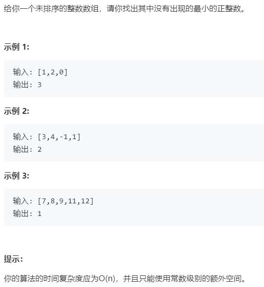

# 41.缺失的第一个正数 (Hard)

## 题目描述



## 思路 & 代码

首先对于长为 n 的数组，结果肯定是 [1, n + 1]，所以我们就按照之前寻找重复元素的方法，交换元素到对应的下标，之后遍历就可以找到第一个缺失的数。交换要注意只处理 [1, n] 的元素即可。

```c++
class Solution {
public:
    int firstMissingPositive(vector<int>& nums) {
        int n = nums.size();
        for(int i = 0; i < n; i++) {
            while(nums[i] >= 1 && nums[i] <= n && nums[nums[i] - 1] != nums[i]) {
                swap(nums[nums[i] - 1], nums[i]);
            }
        }
        for(int i = 0; i < n; i++) {
            if(nums[i] != i + 1) {
                return i + 1;
            }
        }
        return n + 1;
    }
};
```