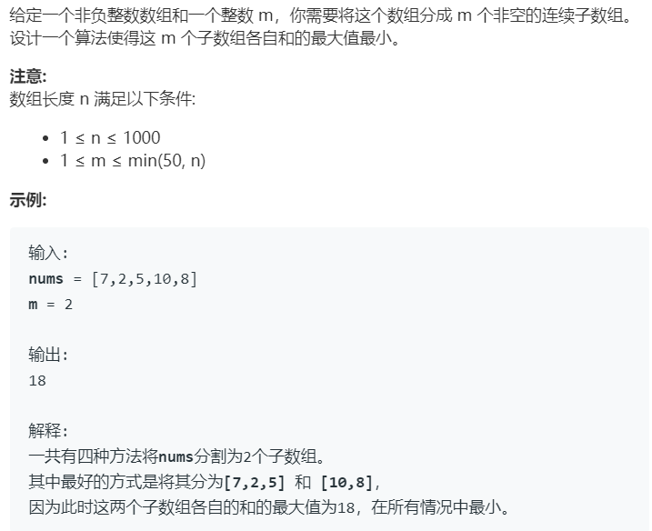

# 410.分割数组的最大值 (Hard)

## 题目描述 



### 标签

二分查找；动态规划；

## 思路 & 代码

数组分成 m 个非空连续子数组，使得子数组和的最大值最小。最大值的范围是 max 到 sum(nums)，二分查找这个最大值，计算当前最大值对应的子数组个数 cnt，cnt > mid 划分的子数组太多，应该 l = mid + 1，否则 r = mid。

看题解还可以用 dp，dp[i][j] 表示数组 nums[0...i] 分成 j 个子数组时得到的最小的最大值。对于第 j 个子数组，dp[i][j] = max(dp[k][j - 1], nums[k + 1] + ... + nums[i]) 即 从 nums[0...k] 分为 j - 1 个数组的最大值与 nums[k + 1...i] 之中的最大值。遍历所有可能的 k 得到 dp[i][j] 的最小值。

```c++ tab="二分查找"
typedef long long ll;
class Solution {
public:
    int splitArray(vector<int>& nums, int m) {
        ll l = nums[0], r = 0;
        for(auto& num : nums) {
            l = max(l, static_cast<ll>(num));
            r += num;
        }
        while(l < r) {
            ll mid = l + (r - l) / 2;
            ll tmp = 0;
            int cnt = 1;    
            for(auto& num : nums) {
                tmp += num;
                if(tmp > mid) {
                    tmp = num;
                    cnt++;
                }
            }
            if(cnt > m) {
                l = mid + 1;
            }else {
                r = mid;
            }
        }
        return l;
    }
};
```

```c++ tab="dp"
typedef long long ll;
class Solution {
public:
    int splitArray(vector<int>& nums, int m) {
        int n = nums.size();
        vector<vector<ll>> dp(n + 1, vector<ll>(m + 1, INT_MAX));
        // 使用前缀和 计算子数组和
        vector<ll> prefix(n + 1, 0);
        for(int i = 0; i < n; i++) {
            prefix[i + 1] = prefix[i] + nums[i];
        }
        dp[0][0] = 0;
        for(int i = 1; i <= n; i++) {
            for(int j = 1; j <= m && j <= i; j++) {
                for(int k = 0; k < i; k++) {
                    dp[i][j] = min(dp[i][j], max(dp[k][j - 1], prefix[i] - prefix[k]));
                }
            }
        }
        return dp[n][m];
    }
};
```