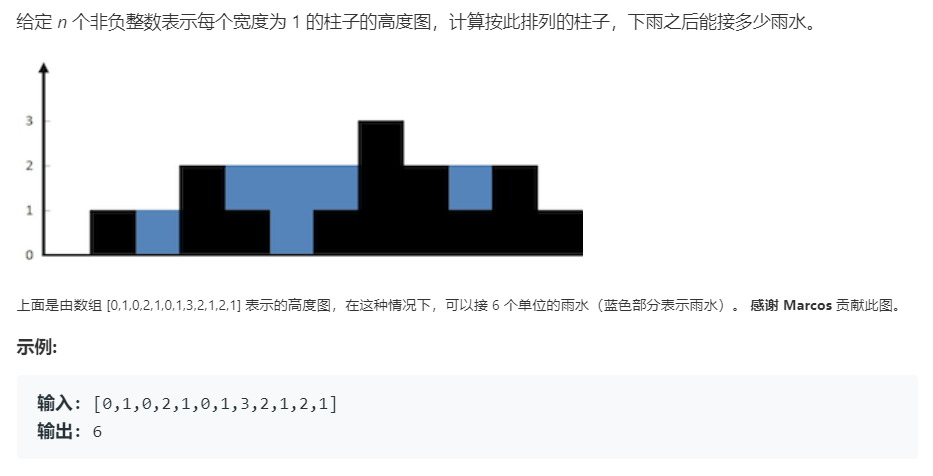

# 42.接雨水 (Hard)

## 题目描述



### 标签

栈；数组；双指针

## 思路 & 代码

看到题目有一点思路，可以一行一行求，不过感觉这样会很慢，事实确实是超时了。。。因为这种方法遍历了那么多次而每次只算一层的。时间复杂度 $O(\max \cdot n)$

按行求不行，可以试一下按列求。感觉要麻烦一些，求当前列最后能有多少水，就是确定左右两边最高的柱子高度，只有在当前高度小于左右最高柱子的较小者时才能接到水。时间复杂度 $O(n^2)$。然而又超时了。。。

按列求的方法最耗时的应该就是找左右的最高柱子，可以优化一下。一次性先求出来就行了。时间复杂度降为 $O(n)$。

先求出所有位置对应的左右最高柱子确实快了很多，但是增加了两个额外的数组，可以把更新 maxl 和 maxr 的操作都放到一起，因为一次只用一对值。不过有一个问题就是 maxl 的更新是从左到右，而 maxr 的更新是从右到左，可以使用双指针优化。时间复杂度 $O(n)$，空间复杂度 $O(1)$。

还可以用栈记录柱子高度，当当前高度小于栈顶高度时，入栈，大于时出栈，并将计算这段的水量。时间复杂度 $O(n)$。

```c++ tab="按行求"
class Solution {
public:
    int trap(vector<int>& height) {
        int n = height.size();
        if(n == 0) {
            return 0;
        }
        int m = *max_element(height.begin(), height.end());
        int res = 0;
        for(int i = 1; i <= m; i++) {
            int tmp = 0;
            bool flag = false;
            for(int j = 0; j < n; j++) {
                if(height[j] < i && flag) {
                    tmp++;
                }else if(height[j] >= i) {
                    res += tmp;
                    tmp = 0;
                    flag = true;
                }
            }
        }
        return res;
    }
};
```

```c++ tab="按列求"
class Solution {
public:
    int trap(vector<int>& height) {
        int n = height.size();
        if(n == 0) {
            return 0;
        }
        int res = 0;
        for(int i = 1; i < n - 1; i++) {
            int l = *max_element(height.begin(), height.begin() + i);
            int r = *max_element(height.begin() + i + 1, height.end());
            if(height[i] < l && height[i] < r) {
                res += min(l, r) - height[i];
            }
        }
        return res;
    }
};
```

```c++ tab="按列 优化"
class Solution {
public:
    int trap(vector<int>& height) {
        int n = height.size();
        if(n == 0) {
            return 0;
        }
        vector<int> maxl(n, 0);
        maxl[0] = height[0];
        for(int i = 1; i < n; i++) {
            maxl[i] = max(maxl[i - 1], height[i - 1]);
        }
        vector<int> maxr(n, 0);
        maxr[n - 1] = height[n - 1];
        for(int i = n - 2; i >= 0; i--) {
            maxr[i] = max(maxr[i + 1], height[i + 1]);
        }
        int res = 0;
        for(int i = 1; i < n - 1; i++) {
            int l = maxl[i];
            int r = maxr[i];
            if(height[i] < l && height[i] < r) {
                res += min(l, r) - height[i];
            }
        }
        return res;
    }
};
```

```c++ tab="双指针"
class Solution {
public:
    int trap(vector<int>& height) {
        int n = height.size();
        if(n == 0) {
            return 0;
        }
        int l = 1;
        int r = n - 2;
        int maxl = height[0];
        int maxr = height[n - 1];
        int res = 0;
        while(l <= r) {
            if(height[l - 1] < height[r + 1]) {
                maxl = max(maxl, height[l - 1]);
                if(maxl > height[l]) {
                    res += maxl - height[l];
                }
                l++;
            }else {
                maxr = max(maxr, height[r + 1]);
                if(maxr > height[r]) {
                    res += maxr - height[r];
                }
                r--;
            }
        }
        return res;
    }
};
```

```c++ tab="栈"
class Solution {
public:
    int trap(vector<int>& height) {
        int n = height.size();
        if(n == 0) {
            return 0;
        }
        stack<int> st;
        int cur = 0;
        int res = 0;
        while(cur < n) {
            while(!st.empty() && height[st.top()] < height[cur]) {
                int h = height[st.top()];
                st.pop();
                // 栈中只有一个元素，也就是相邻的两个柱子
                if(st.empty()) {
                    break;
                }
                int d = cur - st.top() - 1;
                res += d * (min(height[st.top()], height[cur]) - h);
            }
            st.push(cur);
            cur++;
        }
        return res;
    }
};
```