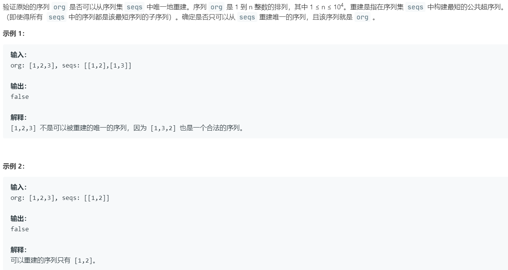

# 444.序列重建 (Medium)

## 题目描述 



### 标签

图论；拓扑排序；

## 思路 & 代码

验证 org 是否可以由 seqs 唯一重建，其实就是对 seqs 进行拓扑排序，要求结果唯一，这就需要每一步只能取唯一一个入度为 0 的节点。

```java
class Solution {
    public boolean sequenceReconstruction(int[] org, List<List<Integer>> seqs) {
        int n = org.length;

        if (n == 0 || seqs.size() == 0) {
            return false;
        }

        // 考虑seqs里头元素为空列表的情况, 已经数字超过n或者<=0的情况
        Set<Integer> numSet = new HashSet<>();
        for (List<Integer> list : seqs) {
            for (Integer num: list) {
                if (num <= 0 || num > n) {
                    return false;
                }
                numSet.add(num);
            }
        }

        if (numSet.size() < n) {
            return false;
        }

        ArrayList<Integer>[] adj = new ArrayList[n + 1];

        for (int i = 1; i <= n; i++) {
            adj[i] = new ArrayList<>();
        }

        // 构建邻接表
        for (int i = 0; i < seqs.size(); i++) {
            List<Integer> pair = seqs.get(i);
            for (int j = 0; j < pair.size() - 1; j++) {
                adj[pair.get(j)].add(pair.get(j+1));
            }
        }

        // 计算每个节点的入度
        int[] inDegree = new int[n + 1];

        for (int i = 1; i <= n; i++) {
            for (int j = 0; j < adj[i].size(); j++) {
                int w = adj[i].get(j);
                inDegree[w]++;
            }
        }

        // 计算入度为0的节点，添加到队列中
        LinkedList<Integer> queue = new LinkedList<>();
        for (int i = 1; i <= n; i++) {
            if (inDegree[i] == 0) {
                queue.addLast(i);
            }
        }

        // 入度为0的节点有多个，就会产生多种序列，或者没有入度为0的，不满足题目要求
        if (queue.size() != 1) {
            return false;
        }

        int index = 0;
        while (!queue.isEmpty()) {
            int num = queue.removeFirst();
            if (org[index] != num) {
                return false;
            }
            index++;

            // 删除当前节点后，所有当前节点的下一个节点的入度为0的个数，超过1则说明序列不唯一
            int nextZeroInDegreeCount = 0;
            for (int j = 0; j < adj[num].size(); j++) {
                int w = adj[num].get(j);
                inDegree[w]--;
                if (inDegree[w] == 0) {
                    nextZeroInDegreeCount++;
                    if (nextZeroInDegreeCount > 1) {
                        return false;
                    }

                    queue.addLast(w);
                }
            }
        }

        return index == n;
    }
};
```